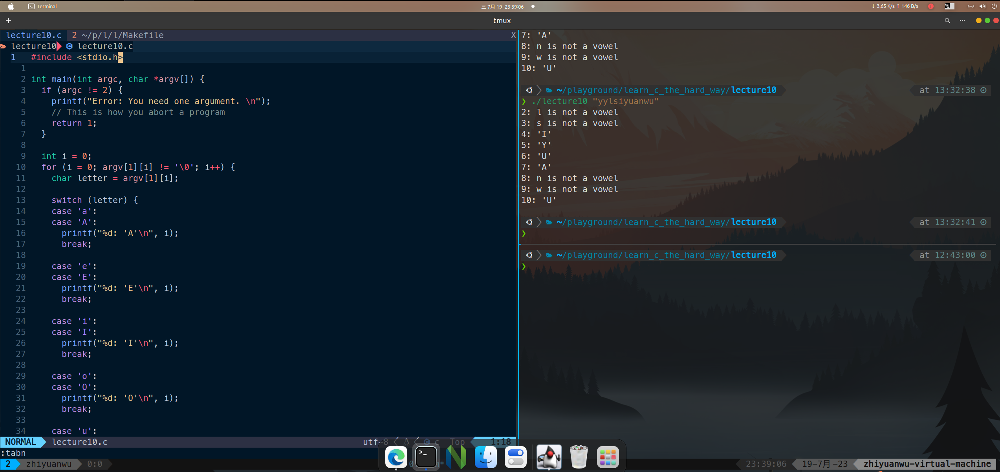

# 20230719 Learn C The Hardway 10

## Switch语句

按照课本要求输入代码，编写Makefile，编译，查看输出

In C, the switch statement is actually quite different and is really a jump table. Instead of
random Boolean expressions, you can only put expressions that result in integers.

