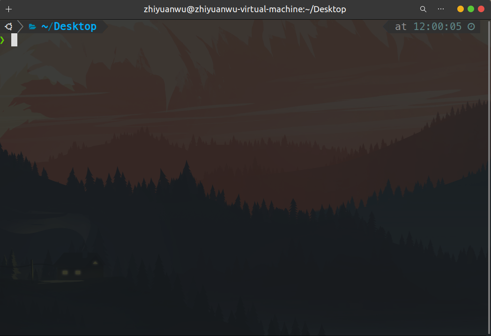

# 20230725 Missing Semester 01 & Learn C The Hardway 12

# 1. Missing Semester 01

## 1.1 Shell环境变量

除了讲义中提到的默认的 Shell类型，也可以配置一下Shell的不同主题，比如搭配zsh的oh-my-zsh，其中提供了很多主题，下图为我目前正在用的powerlevel10k



显示当前所在的位置：

/：表示处在根目录下，~：表示处在home

Shell提供了一些工具可以直接执行，Shell会根据自身检索的环境变量去寻找这些程序

使用echo $PATH可以查看当前的环境变量，这些变量通过 : 分隔


使用which命令可以查看执行的程序所处的位置，也可以通过指定程序的路径来bypass掉在环境变量中搜索的过程


<aside>
💡 如果apt install的工具在命令行中打开时候报错没有这个工具，先检查一下环境变量

</aside>

## 1.2 Shell中导航

cd：进入某个目录，pwd：打印当前目录，ls：列出当前位置下的文件

ls -l：列出当前位置下的文件，使用长格式（带权限等），ls -a：包含隐藏文件（.开头的）

cd ~ ：回到home下， cd -：回到上一个工作目录 

cd .. ： 回到当前目录的父级目录（..表示父级目录，可以使用../../..的方式多次返回）

## 1.3 Shell命令历史检索

最简单的可以使用方向键↑来选择之前的命令，也可以使用ctrl+p来实现完全相同的功能

> 在gdb中↑有特别的作用，因此可以使用ctrl+p执行上次调试的功能
> 

以下内容整理自The art of command line

- In Bash, use **Tab** to complete arguments or list all available commands and **ctrl-r** to search through command history (after pressing, type to search, press **ctrl-r** repeatedly to cycle through more matches, press **Enter** to execute the found command, or hit the right arrow to put the result in the current line to allow editing).
    
    
    
- In Bash, use **ctrl-w** to delete the last word, and **ctrl-u** to delete the content from current cursor back to the start of the line.
- Use **alt-b** and **alt-f** to move by word, **ctrl-a** to move cursor to beginning of line, **ctrl-e** to move cursor to end of line, **ctrl-k** to kill to the end of the line, **ctrl-l** to clear the screen.
- See `man readline` for all the default keybindings in Bash. There are a lot. For example **alt-.** cycles through previous arguments, and **alt-**expands a glob.
- Alternatively, if you love vi-style key-bindings, use `set -o vi` (and `set -o emacs` to put it back).
- For editing long commands, after setting your editor (for example `export EDITOR=vim`), **ctrl-x** **ctrl-e** will open the current command in an editor for multi-line editing. Or in vi style, **escape-v**.
    
    使用ctrl x + ctrl e打开默认编辑器编辑长命令
    
    
    
- To see recent commands, use `history`. Follow with `!n` (where `n` is the command number) to execute again. There are also many abbreviations you can use, the most useful probably being `!$` for last argument and `!!` for last command (see "HISTORY EXPANSION" in the man page). However, these are often easily replaced with **ctrl-r** and **alt-.**.
    
    使用history命令可以查看暂存的过去的命令，使用！行号可以重新执行对应行数的命令
    
    
    

## 1.4 Shell程序连接

在Shell中，程序主要使用两种流，输入流和输出流，当程序尝试读取输入，程序将从输入流中读取。输出同理。一般来说输入是你的键盘，而输出是打印到屏幕上的内容。但是我们可以通过编程改变这个过程

使用>file和<file来重定向输入输出


<aside>
💡 con`cat`enates 连接

</aside>

When given file names as arguments, it prints the contents of each of the files in sequence to its output stream. But when `cat` is not given any arguments, it prints contents from its input stream to its output stream.

使用<<和>>来在原有内容基础上继续添加新内容

使用管道|来连接不同的组件（在下一讲会有更多内容）

比如这个cowsay

> 如果你没装的话，需要提前apt-get install cowsay
> 


## 1.5 Exercise

1. For this course, you need to be using a Unix shell like Bash or ZSH. If you are on Linux or macOS, you don’t have to do anything special. If you are on Windows, you need to make sure you are not running cmd.exe or PowerShell; you can use [Windows Subsystem for Linux](https://docs.microsoft.com/en-us/windows/wsl/) or a Linux virtual machine to use Unix-style command-line tools. To make sure you’re running an appropriate shell, you can try the command `echo $SHELL`. If it says something like `/bin/bash` or `/usr/bin/zsh`, that means you’re running the right program.


使用VMware安装Ubuntu22.04 LTS发行版，zsh以及oh-my-zsh美化

2. Create a new directory called `missing` under `/tmp`.

3.  Look up the `touch` program. The `man` program is your friend.

4.  Use `touch` to create a new file called `semester` in `missing`.

```bash
mkdir temp && cd temp && mkdir missing && cd missing && touch semester
```


5.  Write the following into that file, one line at a time:

`#!/bin/sh
curl --head --silent https://missing.csail.mit.edu`


关于bash中引号的用法：[Double Quotes (Bash Reference Manual) (gnu.org)](https://www.gnu.org/software/bash/manual/html_node/Double-Quotes.html)


1. try to execute the file, i.e. type the path to the script (`./semester`) into your shell and press enter. Understand why it doesn’t work by consulting the output of `ls` (hint: look at the permission bits of the file).
2. Run the command by explicitly starting the `sh` interpreter, and giving it the file `semester` as the first argument, i.e. `sh semester`. Why does this work, while `./semester` didn’t?
3. Look up the `chmod` program (e.g. use `man chmod`).
4. Use `chmod` to make it possible to run the command `./semester` rather than having to type `sh semester`. How does your shell know that the file is supposed to be interpreted using `sh`? See this page on the [shebang](https://en.wikipedia.org/wiki/Shebang_(Unix)) line for more information.


权限不够


使用chmod修改权限，之后就可以使用./执行了


1.  Use `|` and `>` to write the “last modified” date output by `semester` into a file called `last-modified.txt` in your home directory.


对应的文件中


11. Write a command that reads out your laptop battery’s power level or your desktop machine’s CPU temperature from `/sys`. Note: if you’re a macOS user, your OS doesn’t have sysfs, so you can skip this exercise.

虚拟机，查看了一下CPU温度


# 2. Learn C The Hardway 12

## 2.1 示例代码

按照lecture note录入示例代码

```c
#include <stdio.h>

int main(int argc, char *argv[]) {
  int areas[] = {10, 12, 13, 14, 20};
  char name[] = "Zed";
  char full_name[] = {'Z', 'e', 'd', ' ', 'A', '.',
                      ' ', 'S', 'h', 'a', 'w', '\0'};

  // WARNING: On some systems you may have to change the
  //%ld in this code to a %u since it will use unsigned ints
  printf("The size of an int: %ld\n", sizeof(int));
  printf("The size of areas (int[]): %ld\n", sizeof(areas));
  printf("The number of ints in areas: %ld\n", sizeof(areas) / sizeof(int));
  printf("The first area is %d, the 2nd %d.\n", areas[0], areas[1]);

  printf("The size of a char: %ld\n", sizeof(char));
  printf("The size of name(char[]): %ld\n", sizeof(name));
  printf("The size of chars: %ld\n", sizeof(full_name) / sizeof(char));

  printf("The size of full_name (char[]): %ld\n", sizeof(full_name));
  printf("The number of chars: %ld\n", sizeof(full_name) / sizeof(char));

  printf("name=\"%s\" and full_name=\"%s\"\n", name, full_name);

  return 0;
}
```

编写Makefile文件

```makefile
CFLAGS = -Wall -g
all: lecture12

clean:
	rm -f lecture12
```

编译，运行，查看结果


在这段代码中，创建了一些包含不同类型的数组。由于数组是C语言工作原理的核心，所以可以用很多种不同的方法来创建数组。这里使用了

```c
type name[] = {initializer}
```

这个语法的意思是，我需要一个类型为type的数组，并将其初始化为{…}

C语言看到这行代码时，会做以下事情：

- 查看类型，发现程序中需要的类型是int
- 查看[]，发现数组长度并没有给出
- 查看初始化{10, 12, 13, 14, 20}于是要将这5个整数放入数组中
- 在本机创建一个内存区域，用来一次保存这5个整数
- 将你选择的变量名称areas指定到这一内存位置

<aside>
💡 使用sizeof可以查询某些东西的大小

</aside>

## 2.2 破坏程序

- 删除full_name尾部的’\0’并重新运行程序。再在调试器下运行一次，现在将full_name的定义放到main的顶部，areas前面。在调试器下运行几次，看看会不会得到新的出错信息。有时候你可能会幸运到一个错误都看不到

去掉\0


移动full_name位置，给数组初始化之前


初始化之后


确实没有看到错误

- 尝试打印areas[10]而非areas[0] ，并看看调试器有什么意见


- 多做几个类似的尝试，在name和full_name上也尝试一下

C语言貌似不会检查下标越界的问题


## 2.3 附加任务

- 尝试使用areas[0] = 100; 这样的语句对数组areas中的元素进行赋值。
- 尝试对name和full_name的元素进行赋值


对int数组直接赋值就会改变对应的值，char则会显示对应值对应的ASCII表值

- 尝试把areas中的一个元素设置成name中的一个字符

