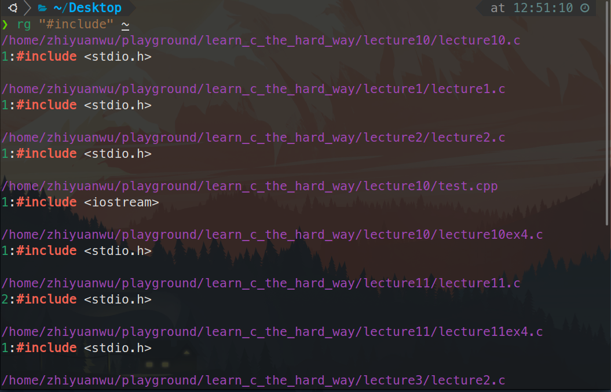

# 20230727 Missing Semester 2-02 & Missing Semester 3

# 1. Missing Semester 2-02

**查找文本**

[grep(1) - Linux manual page (man7.org)](https://www.man7.org/linux/man-pages/man1/grep.1.html)

```bash
# Find all python files where I used the requests library
rg -t py 'import requests'
# Find all files (including hidden files) without a shebang line
rg -u --files-without-match "^#\!"
# Find all matches of foo and print the following 5 lines
rg foo -A 5
# Print statistics of matches (# of matched lines and files )
rg --stats PATTERN
```



对于已经执行过的Shell脚本，可以使用history和rg通过管道相连接来实现查询已经输入过的命令

```bash
history | grep find
```

同样可以使用`Ctrl+R` 来查找命令，而最近的zsh插件已经支持了根据历史自动补全命令，在oh-my-zsh中使用autosuggestion插件即可实现


**在Shell中导航**

可以使用以下工具在Shell中快速导航

[https://github.com/clvv/fasd](https://github.com/clvv/fasd)

[https://github.com/wting/autojump](https://github.com/wting/autojump)

## ****Exercises****

1. Read `[man ls](https://www.man7.org/linux/man-pages/man1/ls.1.html)` and write an `ls` command that lists files in the following manner
    - Includes all files, including hidden files
    - Sizes are listed in human readable format (e.g. 454M instead of 454279954)
    - Files are ordered by recency
    - Output is colorized
    
    A sample output would look like this
    
    ```bash
     -rw-r--r--   1 user group 1.1M Jan 14 09:53 baz
     drwxr-xr-x   5 user group  160 Jan 14 09:53 .
     -rw-r--r--   1 user group  514 Jan 14 06:42 bar
     -rw-r--r--   1 user group 106M Jan 13 12:12 foo
     drwx------+ 47 user group 1.5K Jan 12 18:08 ..
    ```
    


使用ll命令即可实现（ls -l）


1.  Write bash functions `marco` and `polo` that do the following. Whenever you execute `marco` the current working directory should be saved in some manner, then when you execute `polo`, no matter what directory you are in, `polo` should `cd` you back to the directory where you executed `marco`. For ease of debugging you can write the code in a file `marco.sh` and (re)load the definitions to your shell by executing `source marco.sh`.

```bash
#!/usr/bin/env bash

marco(){
  Path=$(pwd)
  echo $Path
}

polo(){
  cd $Path
}
```

1. Say you have a command that fails rarely. In order to debug it you need to capture its output but it can be time consuming to get a failure run. Write a bash script that runs the following script until it fails and captures its standard output and error streams to files and prints everything at the end. Bonus points if you can also report how many runs it took for the script to fail.
    
    ```bash
     *#!/usr/bin/env bash*
    n**=$((** RANDOM **%** 100 **))if** **[[** n -eq 42 **]]**; **then**
        echo "Something went wrong"
        **>**&2 echo "The error was using magic numbers"
        exit 1
     **fi**
    
     echo "Everything went according to plan"
    ```
    

使用一个while循环即可完成这个功能，需要注意的是判断条件要离中括号有一个空格的距离，循环的变量要用双括号包围起来

```bash
#!/usr/bin/env bash

bash wrong.sh
count=1;
while [[ $? -eq 0 ]];
do
  ((count++))
  echo "Everything is right"
  bash wrong.sh
done
  echo "Oops, Wrong, in "$count" times"
```


1. As we covered in the lecture `find`’s `-exec` can be very powerful for performing operations over the files we are searching for. However, what if we want to do something with **all** the files, like creating a zip file? As you have seen so far commands will take input from both arguments and STDIN. When piping commands, we are connecting STDOUT to STDIN, but some commands like `tar` take inputs from arguments. To bridge this disconnect there’s the `[xargs](https://www.man7.org/linux/man-pages/man1/xargs.1.html)` command which will execute a command using STDIN as arguments. For example `ls | xargs rm` **will delete the files in the current directory.**
    
    Your task is to write a command that recursively finds all HTML files in the folder and makes a zip with them. Note that your command should work even if the files have spaces (hint: check `-d` flag for `xargs`).
    

目前没有html文件，以查询C文件并压缩为例代替

```bash
find . -name "*.c" | xargs -d '\n' tar -czf hello.tar;
```

当然也可以通过这种方法创建HTML文件

```bash
touch {1..10}.html
```

注意，可以使用xargs的-t指令查看xargs做了什么


1. (Advanced) Write a command or script to recursively find the most recently modified file in a directory. More generally, can you list all files by recency?

```bash
find . -type f -print0 | xargs -0 ls -lt | head -1
```

当文件较多的时候需要增加一个-mmin条件

```bash
find . -type f -mmin -60 -print0 | xargs -0 ls -lt | head -10
```

# 2. Missing Semester 3

## 1. 在Vim中浏览编辑文本

Vim编辑器最直接的功能就是浏览和编辑文本，只不过它的设计和熟悉了GUI界面的其他编辑器不同。刚上手时可能觉得Vim很不跟手，只要多加练习，很快就能领略到其编辑器之神的称谓。


## 1.1 打开和关闭文件

在命令行中输入以下命令即可通过vim的方式打开某个文件，如果确定有读写权限也可以不用加sudo，打开的界面如上图，非常的简洁。

```bash
sudo vim Filename <Enter>
```

- `:q` **退出（关闭窗口）**
    - 关于退出：退出的方式确实比较特别，一定记得输入最开始那个:**（具体解释见1.3.3）**
        
        
        
- `:w` 保存（写， write）
- `:q!`丢弃所有修改并退出
- `:wq` 保存然后退出
- `:ls` 显示打开的缓存
- `:help {标题}` 打开帮助
- 用 `:sp` / `:vsp` 来分割窗口
- 用`Crtl-W c` / `Crtl-W q` 来关闭分割窗口
- 用 `:sp` / `:vsp` 来分割窗口
- 用`Crtl-W c` / `Crtl-W q` 来关闭分割窗口
- 以下参考：[Vim的分屏功能 | 酷 壳 - CoolShell](https://coolshell.cn/articles/1679.html)
    - **分屏启动Vim**
        - `vim -On file1 file2 ...` 使用大写的O参数来垂直分屏
        - `vim -on file1 file2 ...` 使用小写的o参数来水平分屏
        - **注释:** n是数字，表示分成几个屏
    - **分屏**
        - `Ctrl+W s` 上下分割当前打开的文件
        - `:sp filename` 上下分割，并打开一个新的文件
        - `Ctrl+W v` 左右分割当前打开的文件
        - `:vsp filename` 左右分割，并打开一个新的文件。
    - **移动光标**
        - `Ctrl+W h`  把光标移到**左边**的屏中
        - `Ctrl+W l`  把光标移到**右边**的屏
        - `Ctrl+W j`  把光标移到**下边**的屏中
        - `Ctrl+W k`  把光标移到**上边**的屏中
        - `Ctrl+W w`  把光标移到**下一个**的屏中
    - **移动分屏**
        - `Ctrl+W H`  向左移动
        - `Ctrl+W L`  向右移动。
        - `Ctrl+W J`  向下移动
        - `Ctrl+W K`  向上移动
        - 注：如果你的分屏很乱很复杂的话，这个功能可能会出现一些非常奇怪的症状。
    - 屏幕高度
        - `Ctrl+W =`  让所有的屏都有一样的高度
        - `Ctrl+W +`  增加高度
        - `Ctrl+W -`  减小高度
        - 对于宽度你可以使用`Ctrl+W <` 或是`Ctrl+W >` ，但这可能需要最新的版本才支持。**分屏启动Vim**
        - 同一个缓存可以在多个窗口中显示
        - 参考：[Vim的分屏功能 | 酷 壳 - CoolShell](https://coolshell.cn/articles/1679.html)

## 1.2 移动光标位置

注：**移动光标需要在normal mode（详见2.x）**

使用键盘上的**hjkl**即可实现移动光标位置，使用鼠标滚轮和方向键可以起到相同的作用。

<aside>
💡 **h (左) j (下) k (上) l (右)**

</aside>

### 一些常用的其他移动方式：

- 词： `w` （下一个词）， `b` （词初，begin）， `e` （词尾，end）
- 行： `0` （行初）， `^` （第一个非空格字符）， `$` （行尾）
- 屏幕： `H` （屏幕首行）， `M` （屏幕中间）， `L` （屏幕底部）
- 翻页： `Ctrl-u` （上翻）， `Ctrl-d` （下翻）
- 文件： `gg` （文件头）， `G` （文件尾），`Ctrl-G` （显示当前行数）
- 行数： `**:{行数}<CR>` 或者 `{行数}G` ({行数}为行数)去往指定行**
- 计数：计数来结合“nouns and verbs” ，这会执行指定操作若干次。
    - `3w` 向前移动三个词
    - `5j` 向下移动5行

## 1.3 基本的编辑

### 0. normal模式（正常）

默认打开vim就是normal模式，在以下四个模式时也可以通过按下`ESC` 按键退回到正常模式，在正常模式下可以完成上面提到过的移动光标与浏览文本。

你可以按下 `<ESC>`键从任何其他模式返回正常模式。 在正常模式下

- 键入 `i`进入插入模式
- `v`进入可视（一般）模式， `V`进入可视（行）模式， `<Ctrl-v>`进入可视（块）模式
- `:`进入命令模式。
- 键入`R`进入替换模式

### 1. Insert模式（插入）

- `i`进入insert模式（插入），在插入模式下可以输入文字，这时各个快捷键含义与其在normal mode不同，比如j只是输入字母j的意思而不再有下移的功能
    - `A`在行最末尾进入insert模式
- `O` / `o` 在光标之上/之下插入行
- `d{移动命令}` 删除 {移动命令}
    - **例如， `dw` 删除词, `d$` 删除到行尾, `d0` 删除到行头。**
- `c{移动命令}` 改变 {移动命令}
    - 例如， `cw` 改变单个词 `c$` 改变整行
- `x` 删除字符（等同于 `dl`）
- `s` 替换字符（等同于 `xi`）

**复制粘贴撤销与重做**

- `u` 撤销（大写的U是撤销所有修改）, `<Ctrl-r>` 重做
- `y` 复制 / “yank” （其他一些命令比如 `d` 也会复制）
- `p` 粘贴

**查找与选择性查找**

- `%` （找到**配对括号**，比如括号或者 /* */ 之类的注释对）
- 查找： `f{字符}`， `t{字符}`， `F{字符}`， `T{字符}`
    - 查找/到 向前/向后 在本行的{字符}
    - `,` / `;` 用于导航匹配
- 搜索: `/{正则表达式}`, `n` / `N` 用于导航匹配（向前/向后）

### 2. Visual模式（可视化）

- 可视化：`v` ，可以用移动命令来选中一块内容（更像是大段的选中模式？）
- 可视化行： `V`
- 可视化块：`Ctrl+v`
- 可视化模式 + 操作
    - 选中文字, `d` 删除 或者 `c` 改变

### 3. Command Line模式（命令行）

在normal mode下键入 `:` 进入**命令行模式**。 在键入 `:` 后，你的**光标**会立即**跳到屏幕下方的命令行**。 这个模式有很多功能，比如打开，保存，关闭文件，以及退出 Vim。

- `:!ls` 显示一个目录内的内容
- `:!rm Filename` 移除Filename这个文件
- `:w Filename` 将当前这个vim文件以Filename为名保存到硬盘中
- `v motion :w Filename` 先通过v进入visual mode选择一段话，再将这段内容保存到名为Filename的硬盘中
- `:r Filename` 检索硬盘中名为Filename的文件并将其放在当前光标下的位置
- `:r !dir` 读取dir命令的输出，并显示在光标下方


### 4. Replace 模式（替换）

- `r` 进入替换模式，左下角会显示--REPLACE--，这种场景多见于需要替换多个字符的情况。

此时输入字符可以连续替换光标及其后边的内容。

注意：退格键（Backspace）在替换模式中被解释为**如果左边的内容被替换过，则恢复到原来的样子；如果没有被替换过，则简单的向左移动。**
参考：[vim 替换模式_xueyubingfeng1的博客-CSDN博客](https://blog.csdn.net/xueyubingfeng1/article/details/81088916)

## 2. Vim的设计哲学简介

通过上面简单的一些操作命令，可以将vim用起来了，下面粗浅的讨论下vim的设计哲学，来尝试理解上面这些命令设计时的底层逻辑。


Vim编辑器最底下的一行会显示一些很重要的信息

- 左下角显示当前所处模式（normal模式默认下不会显示，命令行模式会直接显示`**:**`）
    
    
    
- 右下角在normal 模式下会显示当前输入的字符，比如想到500行需要输入500g，可以在右下角看到输入的内容
    
    
    

## 2.1 多模态编辑器

在编程的时候，你会把大量时间花在**阅读/编辑**而不是在写代码上。

<aside>
💡 Vim启动时的默认模式是正常模式，通常你会把大部分时间花在正常模式和插入模式

</aside>

但一直保持在插入模式并不一定是最高效的，所以，Vim是一个多模态编辑器：它对于插入文字和操纵文字有不同的模式：


> 复习：你可以按下 `<ESC>`键从任何其他模式返回正常模式。 在正常模式下
> 
> - 键入 `i`进入插入模式
> - `v`进入可视（一般）模式， `V`进入可视（行）模式， `<Ctrl-v>`进入可视（块）模式
> - `:`进入命令模式。
> - 键入`R`进入替换模式

### ****缓存，标签页，窗口****

Vim 会维护一系列打开的文件，称为“**缓存**”。一个 Vim 会话包含**一系列标签页**，每个标签页包含**一系列窗口（分隔面板）**。**每个窗口显示一个缓存**。缓存和窗口不是一一对应的关系，窗口只是视角

<aside>
💡 一个缓存可以在**多个**窗口打开

</aside>

甚至在同一个标签页内的多个窗口打开（比如在查看同一个文件的不同部分的时候）。


> 复习：
> 
> - 用 `:sp` / `:vsp` 来分割窗口
> - 用`Crtl-W c` / `Crtl-W q` 来关闭分割窗口
> - 以下参考：[Vim的分屏功能 | 酷 壳 - CoolShell](https://coolshell.cn/articles/1679.html)
> - **分屏启动Vim**
>     - `vim -On file1 file2 ...` 使用大写的O参数来垂直分屏
>     - `vim -on file1 file2 ...` 使用小写的o参数来水平分屏
>     - **注释:** n是数字，表示分成几个屏
> - **分屏**
>     - `Ctrl+W s` 上下分割当前打开的文件
>     - `:sp filename` 上下分割，并打开一个新的文件
>     - `Ctrl+W v` 左右分割当前打开的文件
>     - `:vsp filename` 左右分割，并打开一个新的文件。
> - **移动光标**
>     - `Ctrl+W h`  把光标移到**左边**的屏中
>     - `Ctrl+W l`  把光标移到**右边**的屏
>     - `Ctrl+W j`  把光标移到**下边**的屏中
>     - `Ctrl+W k`  把光标移到**上边**的屏中
>     - `Ctrl+W w`  把光标移到**下一个**的屏中
> - **移动分屏**
>     - `Ctrl+W H`  向左移动
>     - `Ctrl+W L`  向右移动。
>     - `Ctrl+W J`  向下移动
>     - `Ctrl+W K`  向上移动
>     - 注：如果你的分屏很乱很复杂的话，这个功能可能会出现一些非常奇怪的症状。
> - 屏幕高度
>     - `Ctrl+W =`  让所有的屏都有一样的高度
>     - `Ctrl+W +`  增加高度
>     - `Ctrl+W -`  减小高度
>     - 对于宽度你可以使用`Ctrl+W <` 或是`Ctrl+W >` ，但这可能需要最新的版本才支持。**分屏启动Vim**

## 2.2 Vim 是可编程的

Vim 的接口本身也是一个程序语言：键入操作（以及其助记名）是命令，这些命令也是**可组合**的。

<aside>
💡 Vim 最重要的设计思想是 Vim 的界面本身是一个程序语言

</aside>

Vim 避免了使用鼠标，因为那样**太慢了**；Vim 甚至避免用上下左右键因为那样**需要太多的手指移动**。

> 命令是**可组合**的：
> 
> - `d{移动命令}` 删除 {移动命令}
>     - 例如， `dw` 删除词, `d$` 删除到行尾, `d0` 删除到行头。
> - `c{移动命令}` 改变 {移动命令}
>     - 例如， `cw` 改变词
>     - 比如 `d{移动命令}` 再 `i`
> - `x` 删除字符（等同于 `dl`）
> - `s` 替换字符（等同于 `xi`）
> - 可视化模式 + 操作
>     - 选中文字, `d` 删除 或者 `c` 改变
> - `u` 撤销, `<C-r>` 重做
> - `3w` 向前移动三个词
> - `5j` 向下移动5行
> - `7dw` 删除7个词
> - 你可以用修饰语改变“名词”的意义。修饰语有 `i`，表示“内部”或者“在内“，和 `a`， 表示”周围“。
>     - `ci(` 改变当前括号内的内容
>     - `ci[` 改变当前方括号内的内容
>     - `da'` 删除一个单引号字符串， 包括周围的单引号

## 3. ****自定义Vim****

Vim是高度可自定义的，事实上我已经基本上把Vim（确切地说是Neovim）变成了另一个样子了，具体可以参考这个Github仓库

[https://github.com/ZyWCN1998/MyDevEnvFile](https://github.com/ZyWCN1998/MyDevEnvFile)

<aside>
💡 不要陷入无休止的自定义编辑器的活动中（奇迹暖暖？），先使用一个“足够好”的编辑器一段时间，再根据痛点来修正

</aside>

## 4. **Exercises**

1. Complete `vimtutor`. Note: it looks best in a [80x24](https://en.wikipedia.org/wiki/VT100) (80 columns by 24 lines) terminal window.

做就完了，确实蛮值得一做的

1. Download our [basic vimrc](https://missing.csail.mit.edu/2020/files/vimrc) and save it to `~/.vimrc`. Read through the well-commented file (using Vim!), and observe how Vim looks and behaves slightly differently with the new config.


添加了行号，使用了相对行数，鼠标支持等

1. Install and configure a plugin: [ctrlp.vim](https://github.com/ctrlpvim/ctrlp.vim).
    1. Create the plugins directory with `mkdir -p ~/.vim/pack/vendor/start`
    2. Download the plugin: `cd ~/.vim/pack/vendor/start; git clone https://github.com/ctrlpvim/ctrlp.vim`
    3. Read the [documentation](https://github.com/ctrlpvim/ctrlp.vim/blob/master/readme.md) for the plugin. Try using CtrlP to locate a file by navigating to a project directory, opening Vim, and using the Vim command-line to start `:CtrlP`.
    4. Customize CtrlP by adding [configuration](https://github.com/ctrlpvim/ctrlp.vim/blob/master/readme.md#basic-options) to your `~/.vimrc` to open CtrlP by pressing Ctrl-P.
    
    
    
    
    
    
    
2. To practice using Vim, re-do the [Demo](https://missing.csail.mit.edu/2020/editors/#demo) from lecture on your own machine.

重新做一遍即可

1. Use Vim for *all* your text editing for the next month. Whenever something seems inefficient, or when you think “there must be a better way”, try Googling it, there probably is. If you get stuck, come to office hours or send us an email.

大概刚好已经用了一个月了


1. Configure your other tools to use Vim bindings (see instructions above).

设置tmux为vim移动模式，使用ctrl a + [ 进入，ctrl c退出（ctrl a是修改后的ctrl b），具体可见下一题内的仓库

1. Further customize your `~/.vimrc` and install more plugins.

[https://github.com/ZyWCN1998/MyDevEnvFile](https://github.com/ZyWCN1998/MyDevEnvFile)

1.  (Advanced) Convert XML to JSON ([example file](https://missing.csail.mit.edu/2020/files/example-data.xml)) using Vim macros. Try to do this on your own, but you can look at the [macros](https://missing.csail.mit.edu/2020/editors/#macros) section above if you get stuck.

# 3. Learn C The Hardway 13

按照课本示例代码编写代码

```c
#include <stdio.h>

int main(int argc, char *argv[]) {
  int i = 0;
  // go through each string in argv
  // why am I skipping argv[0]
  for (i = 1; i < argc; i++) {
    printf("argc %d: %s\n", i, argv[i]);
  }

  // let's make our own array of strings
  char *states[] = {"California", "Oregon", "Washington", "Texas"};
  int num_states = 4;
  for (i = 0; i < num_states; i++) {
    printf("state %d: %s\n", i, states[i]);
  }
  return 0;
}
```

运行程序


字符串数组：

在C语言汇总，创建字符串数字的方式是，将char *str = “blah”语法和char str = {’b’, ‘l’, ‘a’, ‘h’}语法合并，从而构建出一个二维数组。第一层中每个字符串是一个元素，第二层中字符串中的每个字符是一个元素

## 破坏程序

- 将i初始化为0，看会发生什么事情。你还需要调整argc，还是说不调整程序也能正常运行？为什么基于0的索引在这里没有问题？

并不需要调整argc，因为第一个参数（下标是0那个）就是文件名

```bash
❯ ./lecture13 #i am a bunch of arguments #{1..1000001}
argc 0: ./lecture13
```

- 将num_states设为错误值，让它的值过大，看会发生什么事情

出现了段错误

```bash
❯ ./lecture13 #i am a bunch of arguments #{1..1000001}
argc 0: ./lecture13
state 0: California
state 1: Oregon
state 2: Washington
state 3: Texas

❯ ./lecture13 i am a bunch of arguments #{1..1000001} 
argc 0: ./lecture13
argc 1: i
argc 2: am
argc 3: a
argc 4: bunch
argc 5: of
argc 6: arguments
state 0: California
state 1: Oregon
state 2: Washington
state 3: Texas
```

- 将num_states设为错误值，让它的值过大，看看会发生什么事情

段错误

```bash
❯ ./lecture13 #i am a bunch of arguments #{1..1000001}
argc 0: ./lecture13
state 0: California
state 1: Oregon
state 2: Washington
state 3: Texas
[1]    12503 segmentation fault (core dumped)  ./lecture13
```

## 附加任务

- 阅读关于NULL的资料，试着将其用作states数组的某个元素，看看会打印出什么

```bash
❯ ./lecture13 #i am a bunch of arguments #{1..1000001}
argc 0: ./lecture13
state 0: California
state 1: Oregon
state 2: (null)
state 3: Texas
```

- 看看你能不能在打印出二者之前，将states数组中的一个元素赋值给argv数组，再反过来试一下

是可以的


