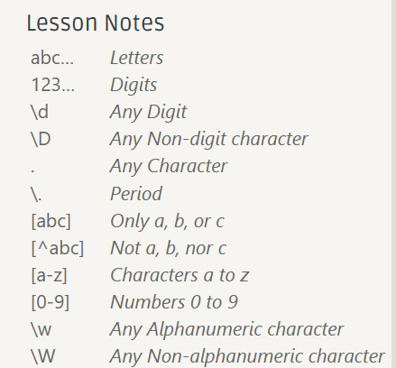

# 20230730 Missing Semester 04 exercise 01

# **Exercises**

1. Take this [short interactive regex tutorial](https://regexone.com/).

做就好了，很快（大概20min）就能做完，贴一个比较重要的总结在这




1.  Find the number of words (in `/usr/share/dict/words`) that contain at least three `a`s and don’t have a `'s` ending. What are the three most common last two letters of those words? `sed`’s `y` command, or the `tr` program, may help you with case insensitivity. How many of those two-letter combinations are there? And for a challenge: which combinations do not occur?

```bash
❯ cat /usr/share/dict/words | tr "[:upper:]" "[:lower:]" | grep -E "(.*a.*){3,}$"|grep -v "'s"|wc -l
854
```

```bash
❯ cat /usr/share/dict/words | tr "[:upper:]" "[:lower:]" | grep -E "(.*a.*){3,}" | grep -v "'s$" | sed -E "s/^.*([a-z]{2})$/\1/" | sort | uniq -c | sort -n | tail -n3
54 as
63 ns
101 an
```

```bash
❯ cat /usr/share/dict/words | tr "[:upper:]" "[:lower:]" | grep -E "(.*a.*){3}" | grep -v "'s$" | sed -E "s/^.*([a-z]{2})$/\1/" | sort | uniq -c | sort -n | wc -l   
112
```

编写一个脚本打印出所有可能的结果

```bash
#! /bin/bash
for i in {a..z};do
  for j in {a..z};do
    echo "$i$j"
  done
done
```

```bash
./all.sh > all.txt
```

```bash
cat /usr/share/dict/words | tr "[:upper:]" "[:lower:]" | grep -E "(.*a.*){3}" | grep -v "'s$" | sed -E "s/^.*([a-z]{2})$/\1/" | sort | uniq > ~/Desktop/appearance.txt
```

通过diff比较这两个文件的不同，并通过grep搜索出来

```bash
diff --unified appearance.txt all.txt | grep -E "^\+(.*)$" | wc -l
```

1. To do in-place substitution it is quite tempting to do something like `sed s/REGEX/SUBSTITUTION/ input.txt > input.txt`. However, this is a bad idea, why? Is this particular to `sed`? Use `man sed` to find out how to accomplish this.

`sed s/REGEX/SUBSTITUTION/ input.txt > input.txt` 表达式中后一个 `input.txt`会首先被清空，而且是发生在前的。所以前面一个`input.txt`在还没有被 `sed` 处理时已经为空了。在使用正则处理文件前最好是首先备份文件。

```bash
sed -i.bak s/REGEX/SUBSTITUTION/ input.txt
```

可以自动创建一个后缀为 `.bak` 的备份文件。

1. Find your average, median, and max system boot time over the last ten boots. Use `journalctl` on Linux and look for log timestamps near the beginning and end of each boot. On Linux, they may look something like:
    
    `Logs begin at ...`
    
    and
    
    `systemd[577]: Startup finished in ...`
    

先tldr一下

```bash
❯ tldr journalctl
journalctl

  Query the systemd journal.
  More information: https://manned.org/journalctl.

  - Show all messages with priority level 3 (errors) from this [b]oot:
    journalctl -b --priority=3

  - Show all messages from last [b]oot:
    journalctl -b -1

  - Delete journal logs which are older than 2 days:
    journalctl --vacuum-time=2d

  - [f]ollow new messages (like tail -f for traditional syslog):
    journalctl -f

  - Show all messages by a specific [u]nit:
    journalctl -u unit

  - Filter messages within a time range (either timestamp or placeholders like "yesterday"):
    journalctl --since now|today|yesterday|tomorrow --until YYYY-MM-DD HH:MM:SS

  - Show all messages by a specific process:
    journalctl _PID=pid

  - Show all messages by a specific executable:
    journalctl path/to/executable
```

-b是启动信息，结合grep，查找关键字

```bash
❯ cat log.txt | sed -E "s/.*=(.*)s.$/\1/"
 9.277
 8.740
 8.830
 9.075
 9.224
 9.534
 8.945
 8.700
 10.710
 9.243
```

```bash
#最长时间
❯ cat log.txt | sed -E "s/.*=(.*)s.$/\1/" | sort -n | tail -1
 10.710
#最短时间
❯ cat log.txt | sed -E "s/.*=(.*)s.$/\1/" | sort -n | head -1
 8.700
#平均数
❯ cat log.txt | sed -E "s/.*=(.*)s.$/\1/" | (paste -sd+) | bc -l | awk '{print $1/10}'
9.2278
#中位数
❯ cat log.txt | sed -E "s/.*=(.*)s.$/\1/" | (paste -sd+) | sort -n | awk '{print ($5+$6)/2}'
9.379
```

1.  Look for boot messages that are *not* shared between your past three reboots (see `journalctl`’s `-b` flag). Break this task down into multiple steps. First, find a way to get just the logs from the past three boots. There may be an applicable flag on the tool you use to extract the boot logs, or you can use `sed '0,/STRING/d'` to remove all lines previous to one that matches `STRING`. Next, remove any parts of the line that *always* varies (like the timestamp). Then, de-duplicate the input lines and keep a count of each one (`uniq` is your friend). And finally, eliminate any line whose count is 3 (since it *was* shared among all the boots).

<aside>
💡 把出现的所有信息排序一下然后把不等于3的提取出来就好了

</aside>

```bash
❯ cat log.txt | sed -E "s/.*zhiyuanwu-virtual-machine (.*)/\1/" | sort | uniq -c | sort | awk '$1!=3  { print }'
```

修改一下记录log的log.sh

```bash
#! /bin/bash
for i in {1..3};do
  journalctl -b -$i
done
```