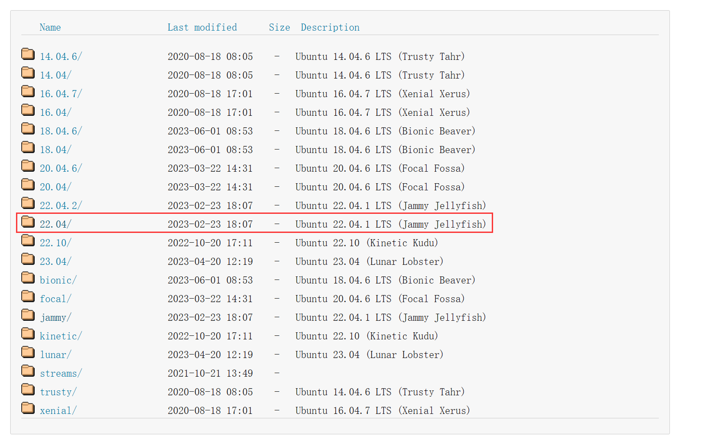

# 20230706 Linux Env. Setup

第六期“一生一芯”学习记录，**仅供本人记录**使用，请勿作为参考

# Linux Virtual Machine Setup

## Installation

Install Ubuntu 22.04 LTS for ysyx project workflow and Vivado design suit.

Download Ubuntu 22.04 LTS image from [Ubuntu Releases](https://releases.ubuntu.com/).



Setting VM


Install, and remember to turn off the auto-update mentioned in lecture notes (PA0).


## Network Proxy setting

VM using the host’s proxy. directly:

Host computer: Windows 10 with clash on Windows.  
VM setting as NAT mode.  Enable allow LAN configuration and set VM’s proxy according to the host’s IP.


## Theme setup

Using gnome tweaker, according to this blog

[Ubuntu 20.04 桌面美化 (zhihu.com)](https://www.zhihu.com/tardis/zm/art/176977192?source_id=1003)

```bash
sudo apt update
sudo apt install gnome-tweaks chrome-gnome-shell
sudo apt install gtk2-engines-murrine gtk2-engines-pixbuf 
sudo apt install sassc optipng inkscape libcanberra-gtk-module libglib2.0-dev libxml2-utils
```

Installing gnome plugins in this website

[GNOME Shell Extensions](https://extensions.gnome.org/)

These plugins are needed.

- user themes
- dash to dock
- netspeed


Nerdfont is necessary for icon displays.  Using MesloLGS NF as the terminal’s font.

[https://github.com/romkatv/powerlevel10k-media/blob/master/MesloLGS NF Regular.ttf](https://github.com/romkatv/powerlevel10k-media/blob/master/MesloLGS%20NF%20Regular.ttf)

Download theme files, icons, cursors, and wallpapers from [Gnome-look.org](https://www.gnome-look.org/browse/).

Exact and move files to proper directory:

- Themes: /usr/share/themes/
- Icons: /usr/share/icons
- Cursors: /usr/share/icons
- Wallpapers: right click and set as wallpaper

Theme files：WhiteSur Gtk Theme

- [https://www.gnome-look.org/p/1403328/](https://link.zhihu.com/?target=https%3A//www.gnome-look.org/p/1403328/)

Icons files：WhiteSur icon theme

- [https://www.pling.com/p/1405756/](https://link.zhihu.com/?target=https%3A//www.pling.com/p/1405756/)

Cursor files：McMojave cursors

- [https://www.pling.com/p/1355701/](https://link.zhihu.com/?target=https%3A//www.pling.com/p/1355701/)

Wallpaper：WhiteSur Wallpaper

- [https://www.pling.com/p/1398833/](https://link.zhihu.com/?target=https%3A//www.pling.com/p/1398833/)

Then, open gnome-tweaks and select proper themes


# Terminal setup

Using this GitHub repo. 

[https://github.com/ZyWCN1998/MyDevEnvFile](https://github.com/ZyWCN1998/MyDevEnvFile)