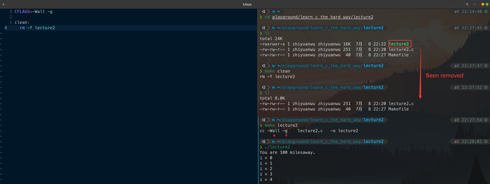

# 20230708 Learn C the Hardway Lecture 2/3

第六期“一生一芯”学习记录，**仅供本人记录**使用，请勿作为参考

# Lecture02

构建Makefile文件，加入clean功能，同时打开显示所有警告与调试功能（-Wall -g）

注意clean后面的块必须使用制表符，不能使用空格

破坏程序，比如使用空格来代替制表符

Makefile:4: *** missing separator. stop. 大概就是有空格了（x）

## 附加任务

1. 创建一个all: lecture2 目标，实现直接输入make即可构建文件

1. 阅读 man make

1. 阅读 man cc，找到-Wall和-g标志功能的更多信息

man cc，之后输入/查找特定字符串

-g

1. 改进一下
2. 找出另一个Makefile文件，尝试弄懂功能

# Lecture03

输入代码

使用make构建文件

上网查找printf支持的所有转义字符与格式化序列

[C 库函数 – printf() | 菜鸟教程 (runoob.com)](https://www.runoob.com/cprogramming/c-function-printf.html)

## 破坏程序：将age从第一个printf中删除

打印出非常不切实际的数，同时注意到gcc与之前配置的语法检测都给出了warning

## 破坏程序：printf恢复到原来的样子，取消对age的赋值

同样打印出了非常不切实际的数，同样注意到了warning

## 附加任务

1. 找出尽可能多的破坏ex3.c的方法
2. 运行man 3 printf 

同样输入/查找特定字符

1. 将ex3加入Makefile的all中

1. 将ex3加入clean列表中

[https://www.notion.so](https://www.notion.so)