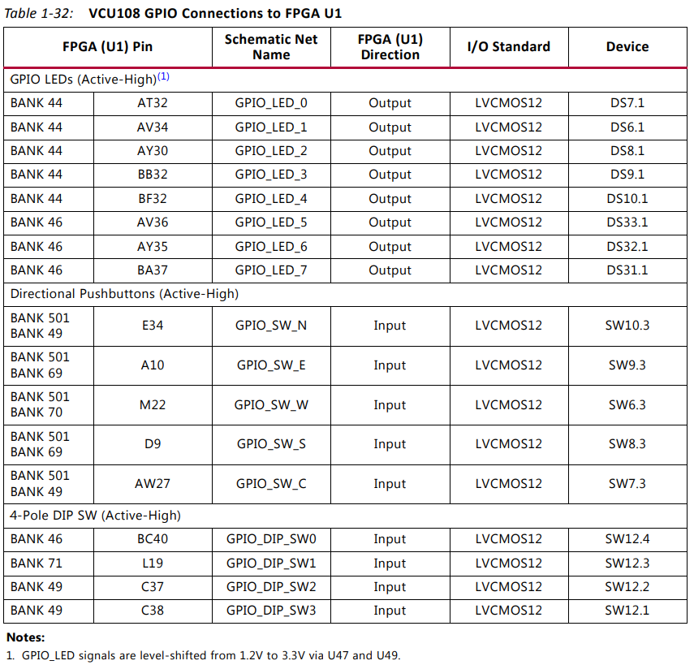

# 20230818 VCU108

从今天开始，我打算把全部FPGA相关开发的内容也并入一生一芯学习记录中。主要有两方面的考量

- 马上研三需要FPGA的内容充实毕业论文，也是通过verilog来写数字逻辑
- 每天不一定还能在繁重的工作下寄出时间推一生一芯的线，同时日常的FPGA开发经验也有助于写一生一芯的RTL部分
- [x]  天天写C真的有点脑袋疼了，时不时换换口味

昨天收到了咸鱼收的VCU108开发板，今天点个灯把它正式用起来，同时熟悉一下板上的资源，为后续做DDS和AWG做准备。

点灯的硬件描述很简单

```verilog
`timescale 1ns / 1ps

module LED(
    input clk,
    input rst_n,

    output [1:0] LED
    );

//define time count reg
reg [25:0] cnt;

assign led = (cnt < 26'd2500_0000) ? 2'b01 : 2'b10;

always @(posedge clk or negedge rst_n)
begin
    if(!rst_n)
        cnt <= 26'd0;
    else if(cnt < 26'd5000_0000)
        cnt <= cnt + 1'b1;
    else
        cnt <= 26'd0;
end

endmodule
```

比较麻烦的是需要在Xilinx浩如烟海的文档里找到时钟和复位的约束

### LED&按键分布：




## 时钟


```verilog
# System clocks
# 300 MHz
#set_property -dict {LOC G31  IOSTANDARD DIFF_SSTL12} [get_ports clk_300mhz_1_p]
#set_property -dict {LOC F31  IOSTANDARD DIFF_SSTL12} [get_ports clk_300mhz_1_n]
#create_clock -period 3.333 -name clk_300mhz_1 [get_ports clk_300mhz_1_p]

# LEDs
set_property -dict {LOC AT32 IOSTANDARD LVCMOS12 SLEW SLOW DRIVE 8} [get_ports {led[0]}]
set_property -dict {LOC AV34 IOSTANDARD LVCMOS12 SLEW SLOW DRIVE 8} [get_ports {led[1]}]
set_property -dict {LOC AY30 IOSTANDARD LVCMOS12 SLEW SLOW DRIVE 8} [get_ports {led[2]}]
set_property -dict {LOC BB32 IOSTANDARD LVCMOS12 SLEW SLOW DRIVE 8} [get_ports {led[3]}]
set_property -dict {LOC BF32 IOSTANDARD LVCMOS12 SLEW SLOW DRIVE 8} [get_ports {led[4]}]
set_property -dict {LOC AV36 IOSTANDARD LVCMOS12 SLEW SLOW DRIVE 8} [get_ports {led[5]}]
set_property -dict {LOC AY35 IOSTANDARD LVCMOS12 SLEW SLOW DRIVE 8} [get_ports {led[6]}]
set_property -dict {LOC BA37 IOSTANDARD LVCMOS12 SLEW SLOW DRIVE 8} [get_ports {led[7]}]

# Reset button
set_property -dict {LOC E36  IOSTANDARD LVCMOS12} [get_ports reset]

# Push buttons
set_property -dict {LOC E34  IOSTANDARD LVCMOS12} [get_ports btnu]
set_property -dict {LOC M22  IOSTANDARD LVCMOS12} [get_ports btnl]
set_property -dict {LOC D9   IOSTANDARD LVCMOS12} [get_ports btnd]
set_property -dict {LOC A10  IOSTANDARD LVCMOS12} [get_ports btnr]
set_property -dict {LOC AW27 IOSTANDARD LVCMOS12} [get_ports btnc]
```