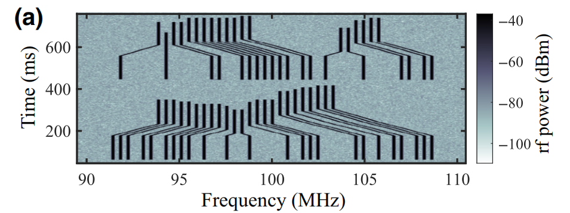

# 20230820 VCU108 Demo design

使用VCU108+ad9129EVM完成一个DDS控制DAC调频输出的Demo，预期效果如下

文献：**Accelerating the Assembly of Defect-Free Atomic Arrays with Maximum Parallelisms**

# 1. 预期架构

**第一种：**纯FPGA实现，直接写UART和SPI的控制模块，不过以目前水平大概只能写很简单的控制器。比如SPI可能只能实现写入固定的序列。

**第二种：**把VCU108分成类似ZYNQ的结构，用Microblaze软核做控制器，UART和SPI都使用软核上的，当成一个大号单片机用。PL部分则当做软核的外设来调用，UART和spi按写单片机的驱动的方式写。

