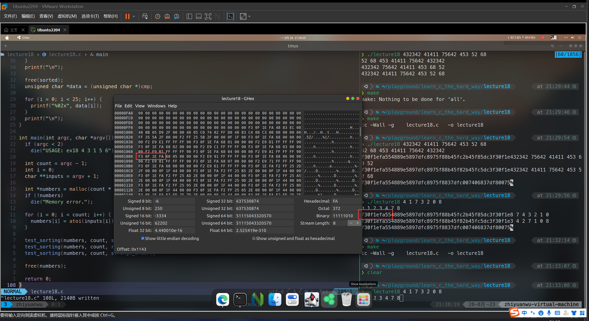

# 20230827 Learn C the Hardway 18

根据讲义内容录入代码，编写Makefile文件

```c
#include <errno.h>
#include <stdio.h>
#include <stdlib.h>
#include <string.h>

/* Our old friend die from ex17. */
void die(const char *message) {
  if (errno) {
    perror(message);
  } else {
    printf("ERROR: %s\n", message);
  }

  exit(1);
}

// a typedef creates a fake type, in this
// case for a function pointer
typedef int (*compare_cb)(int a, int b);

/*
 * A classic bubble sort function that uses the
 * compare_cb to do the sorting
 */
int *bubble_sort(int *numbers, int count, compare_cb cmp) {
  int temp = 0;
  int i = 0;
  int j = 0;
  int *target = malloc(count * sizeof(int));

  if (!target)
    die("Memory error.");

  memcpy(target, numbers, count * sizeof(int));

  for (i = 0; i < count; i++) {
    for (j = 0; j < count - 1; j++) {
      if (cmp(target[j], target[j + 1]) > 0) {
        temp = target[j + 1];
        target[j + 1] = target[j];
        target[j] = temp;
      }
    }
  }
  return target;
}

int sorted_order(int a, int b) { return a - b; }

int reverse_order(int a, int b) { return b - a; }

int strange_order(int a, int b) {
  if (a == 0 || b == 0) {
    return 0;
  } else {
    return a % b;
  }
}

/*
 * Used to test that we are sorting things correctly
 * by doing the sort and printing it out
 */
void test_sorting(int *numbers, int count, compare_cb cmp) {
  int i = 0;
  int *sorted = bubble_sort(numbers, count, cmp);

  if (!sorted)
    die("Failed to sort as required");

  for (i = 0; i < count; i++) {
    printf("%d ", sorted[i]);
  }
  printf("\n");

  free(sorted);
}

int main(int argc, char *argv[]) {
  if (argc < 2)
    die("USAGE: ex18 4 3 1 5 6");

  int count = argc - 1;
  int i = 0;
  char **inputs = argv + 1;

  int *numbers = malloc(count * sizeof(int));
  if (!numbers)
    die("Memory error.");

  for (i = 0; i < count; i++) {
    numbers[i] = atoi(inputs[i]);
  }

  test_sorting(numbers, count, sorted_order);
  test_sorting(numbers, count, reverse_order);
  test_sorting(numbers, count, strange_order);

  free(numbers);

  return 0;
}
```

```bash
❯ ./lecture18 4 1 7 3 2 0 8
0 1 2 3 4 7 8
8 7 4 3 2 1 0
3 4 2 7 1 0 8
```

# 破坏程序

我将让你做一些奇怪的事情去破坏它。这些函数指针和普通指针一样，所以他们指向的是内存块。C语言可以把一种指针转换成另一种，以便你能用不同的方法处理数据。这通常不是必须的，但为了让你看看如何“黑”掉你的电脑，我要求你在test_sorting函数结尾加上这些内容：

```c
unsigned char *data = (unsigned char *)cmp;

for(i = 0; i < 25; i++){
	printf("%02x:", data[i]);
}

printf("\n");
```

这个循环类似于先把你的函数转换成字符串，如何输出它们的内容。除非你正在使用的CPU或者操作系统对你这么做有意见，否则不会破坏你的程序。当它输出这个排序后的数组后，你会看到一个16进制的字符串：

55:48:89:e5:89:7d:fc:89:75:f8:8b:55:fc:8b:45

这应该是这个函数自身的原始汇编字节码，你会看到它们开头都一样，但结尾不同。还可能是这个循环没取得所有的函数，或者是取到太多内容，踩到了程序别的位置。不多分析一下是不会知道的。

# 附加任务

- 找一个十六进制编辑器打开ex18，然后找到包含这个十六进制数位串的函数，看看你是否可以在程序中找到这个函数
    
    
    
- 在你的十六进制编辑器中随便找点儿别的东西，修改它们。回到你的程序看看发生了什么。修改你找到的字符串是最容易的
    
    我用的十六进制编辑器好像不能进行修改，而且感觉修改也是一个比较危险的事情
    
- 给compare_cb传入错误的函数，然后看看C编译器提示什么信息。
    
    传入一个返回值为空的函数
    
    ```c
    void wrong_order(int a, int b) {
      ;
    }
    
    test_sorting(numbers, count, wrong_order);
    ```
    
    ```bash
    ❯ make
    cc -Wall -g    lecture18.c   -o lecture18
    lecture18.c: In function ‘main’:
    lecture18.c:106:32: warning: passing argument 3 of ‘test_sorting’ from incompatible pointer type [-Wincompatible-pointer-types]
      106 |   test_sorting(numbers, count, wrong_order);
          |                                ^~~~~~~~~~~
          |                                |
          |                                void (*)(int,  int)
    lecture18.c:66:55: note: expected ‘compare_cb’ {aka ‘int (*)(int,  int)’} but argument is of type ‘void (*)(int,  int)’
       66 | void test_sorting(int *numbers, int count, compare_cb cmp) {
          |                                            ~~~~~~~~~~~^~~
    ```
    
- 传入NULL看看你的程序出了什么问题。然后运行调试器看看报告了什么。
    
    ```c
    	test_sorting(numbers, count, NULL);
      test_sorting(numbers, count, NULL);
      test_sorting(numbers, count, NULL);
    ```
    
    ```bash
    ❯ ./lecture18ex4 4 1 7 3 2 0 8
    [1]    351693 segmentation fault (core dumped)  ./lecture18ex4 4 1 7 3 2 0 8
    ```
    
- 再写一个排序算法，然后修改test_sorting，让它可以接受任意排序函数以及排序函数的回调比较。用它来调试你的两个算法。
    
    参考：[Learn-C-The-Hard-Way-Exercise/Ex18 at master · Frederick-S/Learn-C-The-Hard-Way-Exercise (github.com)](https://github.com/Frederick-S/Learn-C-The-Hard-Way-Exercise/tree/master/Ex18)
    
    ```c
    #include <errno.h>
    #include <stdio.h>
    #include <stdlib.h>
    #include <string.h>
    
    // Our old friend die from ex17
    void die(const char *message) {
      if (errno) {
        perror(message);
      } else {
        printf("ERROR: %s\n", message);
      }
    
      exit(1);
    }
    
    // A typedef creates a fake type, in this
    // case for a function pointer
    typedef int (*compare_cb)(int a, int b);
    
    typedef int *(*custom_sort)(int *numbers, int count, compare_cb cmp);
    
    // A classic bubble sort function that uses the
    // compare_cb to do the sorting
    int *bubble_sort(int *numbers, int count, compare_cb cmp) {
      int temp = 0;
      int i = 0;
      int j = 0;
      int *target = malloc(count * sizeof(int));
    
      if (!target) {
        die("Memory error.");
      }
    
      memcpy(target, numbers, count * sizeof(int));
    
      for (i = 0; i < count; i++) {
        for (j = 0; j < count - 1; j++) {
          if (cmp(target[j], target[j + 1]) > 0) {
            temp = target[j + 1];
            target[j + 1] = target[j];
            target[j] = temp;
          }
        }
      }
    
      return target;
    }
    
    void quick_sort_internal(int *target, int low, int high, compare_cb cmp);
    int quick_sort_partition(int *target, int low, int high, compare_cb cmp);
    
    int *quick_sort(int *numbers, int count, compare_cb cmp) {
      int *target = malloc(count * sizeof(int));
    
      if (!target) {
        die("Memory error.");
      }
    
      memcpy(target, numbers, count * sizeof(int));
    
      quick_sort_internal(target, 0, count - 1, cmp);
    
      return target;
    }
    
    void quick_sort_internal(int *target, int low, int high, compare_cb cmp) {
      if (low < high) {
        int pivot = quick_sort_partition(target, low, high, cmp);
    
        quick_sort_internal(target, low, pivot - 1, cmp);
        quick_sort_internal(target, pivot + 1, high, cmp);
      }
    }
    
    int quick_sort_partition(int *target, int low, int high, compare_cb cmp) {
      int temp = 0;
      int pivot_value = target[(low + high) / 2];
    
      while (low < high) {
        while (cmp(target[low], pivot_value) < 0) {
          low++;
        }
    
        while (cmp(target[high], pivot_value) > 0) {
          high--;
        }
    
        if (low < high) {
          temp = target[low];
          target[low] = target[high];
          target[high] = temp;
        }
      }
    
      return high;
    }
    
    int sorted_order(int a, int b) { return a - b; }
    
    int reverse_order(int a, int b) { return b - a; }
    
    int strange_order(int a, int b) {
      if (a == 0 || b == 0) {
        return 0;
      } else {
        return a % b;
      }
    }
    
    // Used to test that we are sorting things correctly
    // by doing the sort and printing it out.
    void test_sorting(int *numbers, int count, compare_cb cmp, custom_sort sort) {
      int i = 0;
      int *sorted = sort(numbers, count, cmp);
    
      if (!sorted) {
        die("Failed to sort as requested.");
      }
    
      for (i = 0; i < count; i++) {
        printf("%d ", sorted[i]);
      }
    
      printf("\n");
    
      free(sorted);
    }
    
    int main(int argc, char *argv[]) {
      if (argc < 2) {
        die("USAGE: ex18 4 3 1 5 6");
      }
    
      int count = argc - 1;
      int i = 0;
      char **inputs = argv + 1;
    
      int *numbers = malloc(count * sizeof(int));
      if (!numbers) {
        die("Memory error.");
      }
    
      for (i = 0; i < count; i++) {
        numbers[i] = atoi(inputs[i]);
      }
    
      printf("Bubble sort:\n");
    
      test_sorting(numbers, count, sorted_order, bubble_sort);
      test_sorting(numbers, count, reverse_order, bubble_sort);
      test_sorting(numbers, count, strange_order, bubble_sort);
    
      printf("Quick sort:\n");
      test_sorting(numbers, count, sorted_order, quick_sort);
      test_sorting(numbers, count, reverse_order, quick_sort);
      test_sorting(numbers, count, strange_order, quick_sort);
    
      free(numbers);
    
      return 0;
    }
    ```
    
    ```bash
    ❯ ./lecture18ex5 4 3 7 11 13 23 37
    Bubble sort:
    3 4 7 11 13 23 37
    37 23 13 11 7 4 3
    4 3 7 11 13 23 37
    Quick sort:
    3 4 7 11 13 23 37
    37 23 13 11 7 4 3
    11 4 13 7 23 3 37
    ```