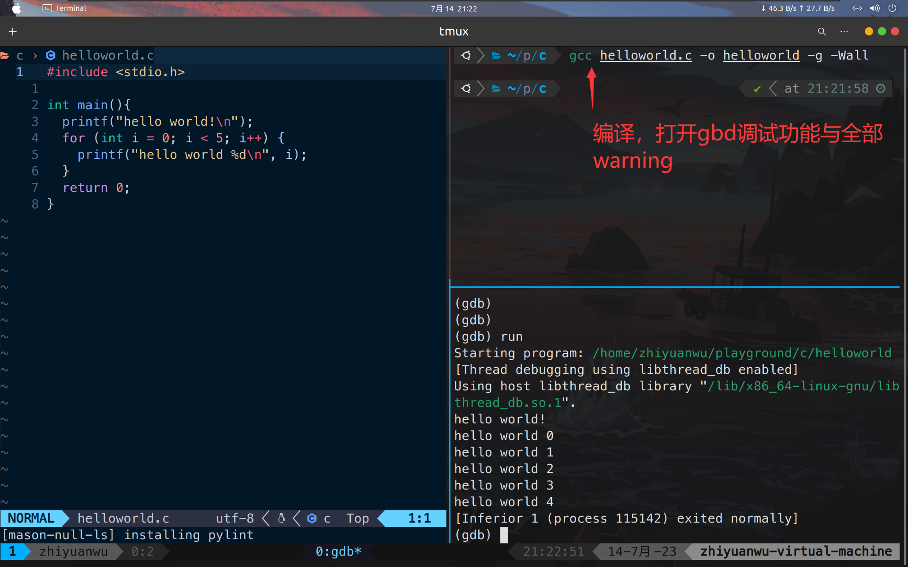

# 20230714 GDB test & Makefile

### Official GDB tutorial summary

对昨天学习内容总结

```jsx
g++ main.cpp -g -Wall -Werror -o main
gdb <filename> #使用gdb调试特定文件名
break <sourcefile line number> #在调试文件特定位置放置断点
run #使程序开始运行到断点位置
continue #继续暂停的程序
list #程序停止时显示断点附近的10行内容（显示停在了什么位置）
next  #下一行
step #进入函数内部
print <variable name> #打印查看变量值
set <varname> = <value> #设置变量值为value，直接改变变量值
watch <var> #设置某个变量为watch point
info break #查看断点（类似ls）
info watch #查看监控点（类似ls）
```

### Example

编译文件，使用-g命令打开gdb调试功能



在main行放置断点，run程序，至断点处并查看附近的代码


使用run命令使程序运行至断点处


使用next执行下一行


使用watch查看变量i的值


使用continue命令使暂停的程序继续运行


使用info命令查看断点与监控点的情况


### 编写一个Makefile自动编译

根据7月8日学习内容编写了一个Makefile文件，可以实现输入make自动编译该文件并产生helloworld可执行文件

