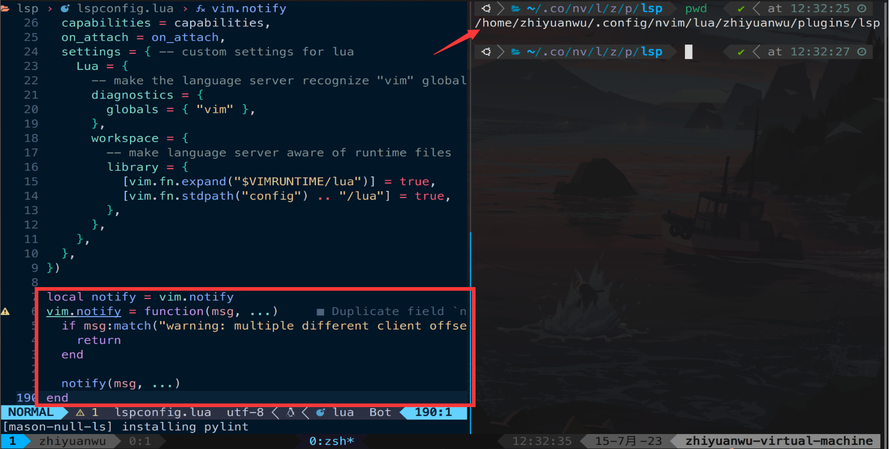

# 20230715 Lean C The Hardway Lecture & Bug Fix

## Bug fix

之前配置的nvim的编辑器lsp功能，但使用clang做c语言的格式和语法检查的时候经常会出现warning

```bash
warning: multiple different client offset_encodings detected for buffer, this is not supported yet
```

可以修改vim.notify函数，当匹配到如上字符串的时候直接return，不再显示即可

在lsp文件夹中最后加入以下代码即可

```lua
local notify = vim.notify
vim.notify = function(msg, ...)
    if msg:match("warning: multiple different client offset_encodings") then
        return
    end

    notify(msg, ...)
end
```

这样便不再会出现每打一行光标都会跳出来一次warning的场景



## Learn C the Hardway Lecture 7

### 1. 编写示例程序

根据书内容编写文件与Makefile，主要是一些输入输出的内容

<aside>
💡 特别需要注意的是C语言中的字符其实就是int，可以参与到运算中

</aside>


执行效果，与课本中相同


### 2. Break it ！

书中提到了一种Break程序的方式，即不使用%d，而是使用%s和%c来打印’\0’，可以看一下效果

- 使用%c来打印，执行出问题，没有打印出任何东西


- 使用%s来打印

可以看到gcc和clang（自己配置的nvim的lsp）都报了warning


结果也是错的，打印出了null


### 3. 附加题


可以看到数值过大的时候gcc给出warning


运行结果发现溢出


下表给出了一些常见的数据范围，注意使用过程中不要超过这些范围，否则会发生溢出


unsigned可以扩展非unsinged的范围，但是只能表示正数