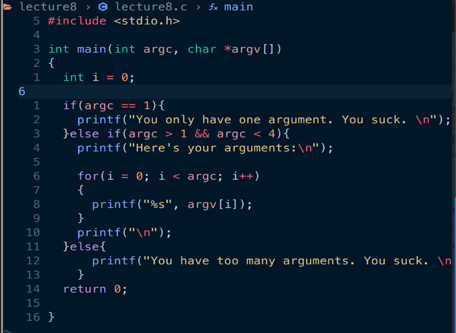

# 20230716 Learn C the Hardway 08

根据要求编写源代码

其中 argc为命令行传入参数的个数，argv[]内部以此存储了参数。需要注意的是比如执行./lecture8的时候，lecture8本身也是一个参数。

编写对应的Makefile文件，实现一键make编译生成可执行文件

传入参数，执行文件，并使用之前学到的gdb调试器内容设置断点查看参数的值等：

