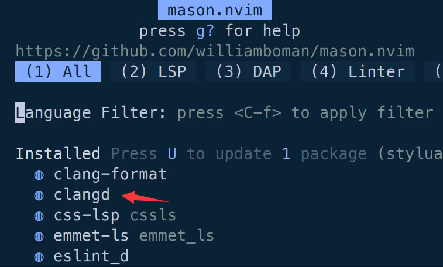

# 20230717 Bug Fix & Learn C The Hardway 08 continue

## Bug Fix

Here are still some bugs in my neovim development platform.  For C programming, auto format was added to neovim today.

Besides installing clangd in Mason and configured it in LSP setting, I still have to install clangd-format in Mason formatter secretion:

After installing clang-format, press w + Enter in vim command can using clang-format.  

When installing, if vim warning about python3 venv, installing python3 venv(specific version) using pip install.  Before using pip install, reset all socks proxy first.  Otherwise, an OS error with a lack of dependency of socks.  Close the system proxy in settings and comment proxy statements in .zshrc. Source .zshrc and installing clang-format.  After clang-format being installed successfully.  Proxy can be reset to use again.

## Break the program of Lecture 8

### Remove the last else statement, using comment.  Missing edge state can be observed.

### Replace && to ||

AND become OR in if statement.  So, if number of arguments less than 1. First comparison can give the result of “You only have one argument. You suck.” and the programm exit with return code 0.

However, if the number of arguments more than 4, the program still gives out the number instead of “You have too many arguments. You suck.”  The last edge state seems to be “shorted”.

## Extra Credit

1. Boolean operators in C: && AND, || OR, ! NOT

1. Change the program to print the first user input parameter.

