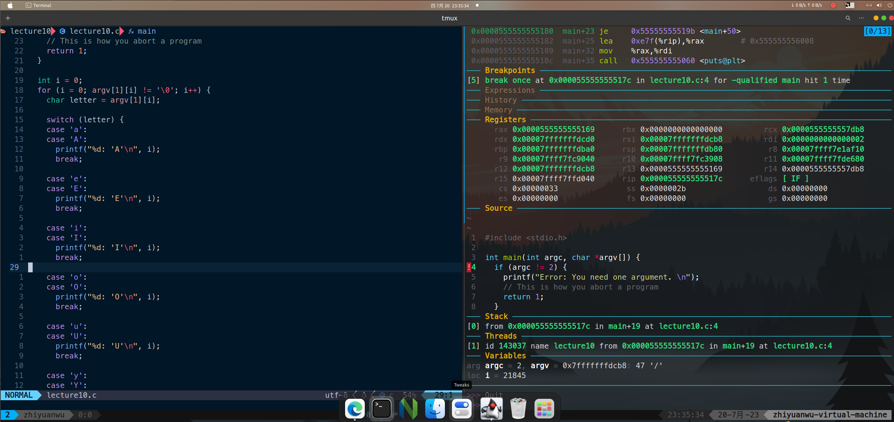

# 20230720 GDB dashboard

今天暂停了一天Learn C the Hardway

尝试了一个有意思的小工具：gdbdashboard

因为gdb已经提供了Python兼容运行的能力，因此可以自定义一个自己需要的gdb layout，比之前那个tui看起来用起来都舒服多了，甚至还有代码高亮的功能。

github地址：https://github.com/cyrus-and/gdb-dashboard

实际使用效果

dashboard会在程序自动停止在断点时候出现，默认的layout其实就展示了一个不错的调试界面，甚至有一种接近ide的感觉了

类似的gdb调试前端还有gdb frontend（甚至给出了搭配openOCD调试嵌入式设备比如stm32的能力）gdb gui等等，我把github界面一并记录在这里，后面有时间尝试下。

现在基本上构建起来一个相对来说可用的工具链：

- nvim：通过lsp+mason实现语言服务和管理插件等，能做到代码高亮，代码补全，自动跳转，模糊查找等功能，接近一个现代ide具有的能力
- gdb: gdb dashboard基本满足了调试小程序的功能，目前用起来还是很舒服的
- tmux: 多个命令行的layout，多个会话，且能在关机后保存会话，非常好用