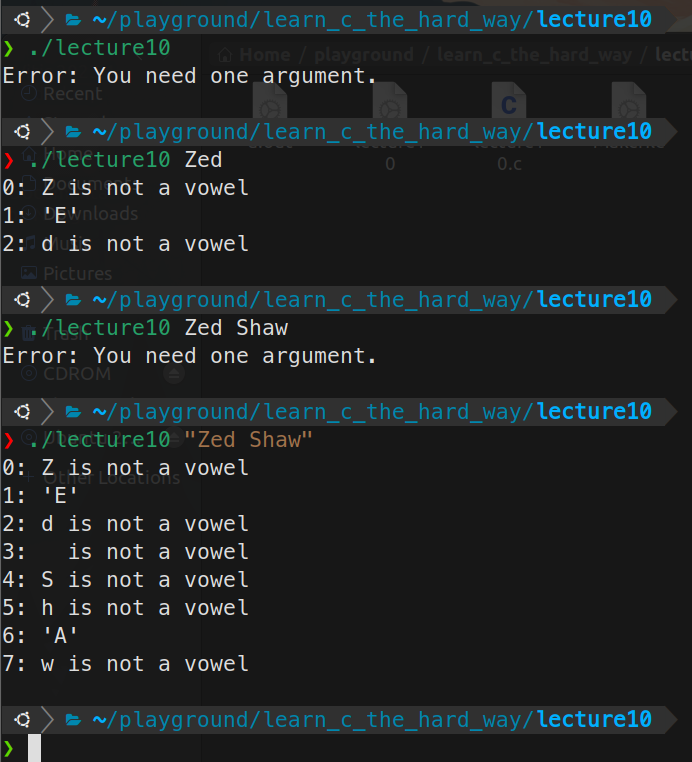

# 20230721 Learn C The Hardway 10-2

## Switch语句

按照教材输入代码

```c
#include <stdio.h>

int main(int argc, char *argv[]) {
  if (argc != 2) {
    printf("Error: You need one argument. \n");
    // This is how you abort a program
    return 1;
  }

  int i = 0;
  for (i = 0; argv[1][i] != '\0'; i++) {
    char letter = argv[1][i];

    switch (letter) {
    case 'a':
    case 'A':
      printf("%d: 'A'\n", i);
      break;

    case 'e':
    case 'E':
      printf("%d: 'E'\n", i);
      break;

    case 'i':
    case 'I':
      printf("%d: 'I'\n", i);
      break;

    case 'o':
    case 'O':
      printf("%d: 'O'\n", i);
      break;

    case 'u':
    case 'U':
      printf("%d: 'U'\n", i);
      break;

    case 'y':
    case 'Y':
      if (i > 2) {
        // it's only sometimes y
        printf("%d: 'Y'\n", i);
      }
      break;

    default:
      printf("%d: %c is not a vowel \n", i, letter);
    }
  }
  return 0;
}
```

命令行执行程序，观察程序输出



## 破坏程序

- 忘记一处break，程序将会运行两个或者更多你本不期望运行的代码块
- 忘记一处default，他就会默默地忽略那些你没有考虑到的值
- 意外地放一个值为非预期的变量在Switch语句中，如一个int，它会变成一个奇怪的值
- 在Switch语句中使用未初始化的变量

## 附加任务

1. 再写一个程序，对字母做一些数学运算，将他们转换成小写字母，然后删除Switch中那些多余的大写字母分支

加入如下代码，实现大写转小写


首先查阅ASCii码表，发现大写到小写有一个固定的对应关系，因此做一次加法就可以了


1. 使用逗号’,’来初始化for循环中的letter


1. 让它再使用一个for循环来处理所有你传入的参数


1. 把Switch语句改写为if语句

使用if-else循环判断，逻辑较为复杂


1. 在’Y’这个case中，我把break放到了if语句外面。如果把他放在if语句内部会发生什么事情，有什么样的影响？

If the break is outside the if-statement, then it can correctly end the switch-statement, otherwise, it will continue executing the code in `default` branch under some conditions.

