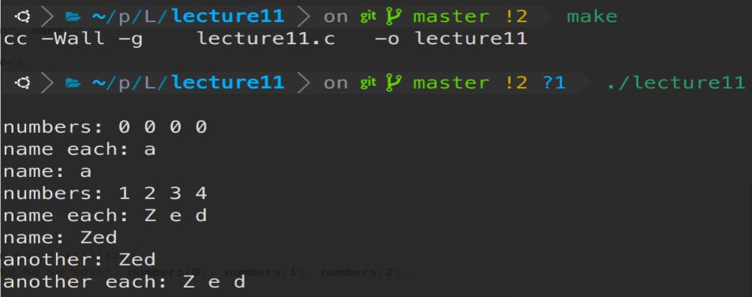

# 20230722 Learn C The Hardway11-2

# 代码示例部分

按照课本中的内容输入代码，编写Makefile文件并运行

```c
#include <stdio.h>

int main(int argc, char *argv[]) {

  int numbers[4] = {0};
  char name[4] = {'a'};

  // first, print them out raw
  printf("numbers: %d %d %d %d\n", numbers[0], numbers[1], numbers[2],
         numbers[3]);

  printf("name each: %c %c %c %c\n", name[0], name[1], name[2], name[3]);
  printf("name: %s\n", name);

  // setup the numbers
  numbers[0] = 1;
  numbers[1] = 2;
  numbers[2] = 3;
  numbers[3] = 4;

  // setup the name
  name[0] = 'Z';
  name[1] = 'e';
  name[2] = 'd';
  name[3] = '\0';

  // then print them out initialized
  printf("numbers: %d %d %d %d\n", numbers[0], numbers[1], numbers[2],
         numbers[3]);

  printf("name each: %c %c %c %c\n", name[0], name[1], name[2], name[3]);

  // print the name like a string
  printf("name: %s\n", name);

  // another way to use name
  char *another = "Zed";

  printf("another: %s\n", another);

  printf("another each: %c %c %c %c\n", another[0], another[1], another[2],
         another[3]);

  return 0;
}
```

可以看到命令行输出结果



现在来解释这个代码：

- ’\0’是一个特殊的字符串，是不会被打印的
- 如果初始化数组的时候只设置了一个数，那么剩下的元素会被0填充
- 当创建字符串字面量的时候，应该使用典型的 char *another = “Literal”语法

# 破坏程序

<aside>
💡 几乎所有的C程序中的bug都是由没有准备足够的空间（下标越界），或者没有在字符串结尾添加’\0’

</aside>

在这个程序中，破坏程序的关键方式是忘记在字符串结尾添加’\0’字符

- 删除设置name数组的初始化语句：可以看到程序仍然正常执行且没有warning，name仍然初始化了000


- 无意间设置了name[3] = ‘A’，这样就没有终止符了：同上


- 初始式设置为了{’a’,’a’,’a’,’a’} ，这样a太多了，就没有足够空间放’\0’终止符了：程序同样成功执行了

