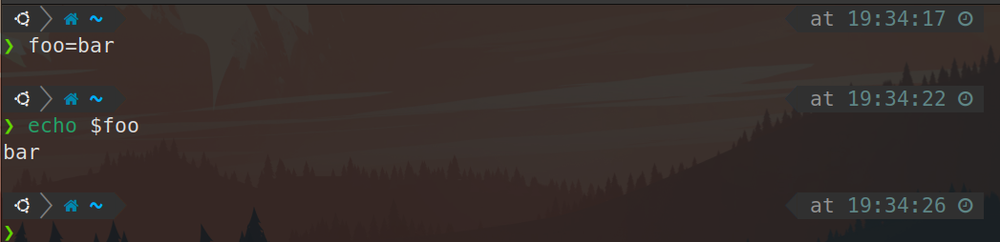

# 20230726 Missing Semester 02

# Missing Semester 02

Shell是可编程的，可以像一个编程语言来对待他，比如可以通过如下手段来给变量赋值，并使用这个变量。

```bash
foo=bar
echo "$foo"
# prints barecho '$foo'
# prints $foo
```



<aside>
💡 注意空格，foo = bar是不行的，shell会认为foo是第一个参数，而不是赋值

</aside>


如上一个练习题中看到的，使用””和’’来表达字符串时会有不同的效果：

- 双引号：将字符串内有特殊含义的字符（比如变量，运算符等）展开为对应值
- 单引号：单纯的打印所有字符


bash中也是可以编写函数的，同样有`if`, `case`, `while` 和`for`这样的流程控制

```bash
mcd(){mkdir -p "$1"
    cd "$1"
}
```


注意这里面的$1类似C中的*argv[]，它从命令行中接收参数，摘录讲义中关于此种参数的定义

- `$0` - Name of the script
- `$1` to `$9` - Arguments to the script. `$1` is the first argument and so on.
- `$@` - All the arguments
- `$#` - Number of arguments
- `$?` - Return code of the previous command
- `$$` - Process identification number (PID) for the current script
- `!!` - Entire last command, including arguments. A common pattern is to execute a command only for it to fail due to missing permissions; you can quickly re-execute the command with sudo by doing `sudo !!`
- `$_` - Last argument from the last command. If you are in an interactive shell, you can also quickly get this value by typing `Esc` followed by `.` or `Alt+.`

Shell脚本通过STDOUT来输出，通过STDERR来抛出错误同时返回一个代表错误的返回值，类似C，返回值为0一般代表正常，非0值一般代表出错

注意逻辑运算符是短路的（对于&&来说执行到第一个错误的命令就退出。对于||来说则正相反，执行到第一个正确的命令就退出），如下面的例子所展示的。如果只是单纯的想连接两个命令，可以使用分号;来连接

```bash
false || echo "Oops, fail"
# Oops, fail

true || echo "Will not be printed"
#

true && echo "Things went well"
# Things went well

false && echo "Will not be printed"
#

true ; echo "This will always run"
# This will always run

false ; echo "This will always run"
# This will always run
```

变量替换（*command substitution*）

<aside>
💡 $(CMD)来执行变量时，输出结果会替换掉$(CMD)

</aside>

比如执行`for file in $(ls)` ，shell首先将调用`ls` ，然后遍历得到的这些返回值

进程替换（*process substitution*）

<aside>
💡 `<( CMD )` 会执行 `CMD` 并将结果输出到一个临时文件中，并将 `<( CMD )` 替换成临时文件名

</aside>

`diff <(ls foo) <(ls bar)` 会显示文件夹 `foo` 和 `bar` 中文件的区别

比如写一个小程序来统计某路径下的文件字节数

```bash
#!/bin/bash

wordcount(){
cd "$1"
for file in $(ls) 
do
  wc -w $file
done
cd -
}
```


```bash
#!/bin/bash

echo "Starting program at $(date)" # Date will be substituted

echo "Running program $0 with $# arguments with pid $$"

for file in "$@"; do
    grep foobar "$file" > /dev/null 2> /dev/null
    # When pattern is not found, grep has exit status 1
    # We redirect STDOUT and STDERR to a null register since we do not care about them
    if [[ $? -ne 0 ]]; then
        echo "File $file does not have any foobar, adding one"
        echo "# foobar" >> "$file"
    fi
done
```

这个例子给出了更详细的使用方法

<aside>
💡 在bash中进行比较时，尽量使用双方括号 `[[ ]]` 而不是单方括号 `[ ]`，这样会降低犯错的几率

</aside>

**通配**

通配符：使用`?` 和 `*` 来匹配一个或任意个字符。

例如，对于文件`foo`, `foo1`, `foo2`, `foo10` 和 `bar`, `rm foo?`这条命令会删除`foo1` 和 `foo2` ，而`rm foo*` 则会删除除了`bar`之外的所有文件。

花括号：括号`{}` ， 当有一系列的指令，其中包含一段公共子串时，可以用花括号来自动展开这些命令。这在批量移动或转换文件时非常方便。

```bash
convert image.{png,jpg}
# 会展开为
convert image.png image.jpg

cp /path/to/project/{foo,bar,baz}.sh /newpath
# 会展开为
cp /path/to/project/foo.sh /path/to/project/bar.sh /path/to/project/baz.sh /newpath

# 也可以结合通配使用
mv *{.py,.sh} folder
# 会移动所有 *.py 和 *.sh 文件

mkdir foo bar

# 下面命令会创建foo/a, foo/b, ... foo/h, bar/a, bar/b, ... bar/h这些文件
touch {foo,bar}/{a..h}
touch foo/x bar/y
# 比较文件夹 foo 和 bar 中包含文件的不同
diff <(ls foo) <(ls bar)
# 输出
# < x
# ---
# > y
```

命令行不止可以执行基于命令行的脚本，指定了运行程序也可以执行诸如Python等其他语言写成的脚本。在#!行标注环境是一个好的习惯

```python
#!/usr/local/bin/python
import sys
for arg in reversed(sys.argv[1:]):
    print(arg)
```

<aside>
💡 函数只能与shell使用相同的语言，脚本可以使用任意语言。因此在脚本中包含 `shebang` 是很重要的

</aside>

函数会在当前的shell环境中执行，脚本会在单独的进程中执行。因此，函数可以对环境变量进行更改，比如改变当前工作目录，脚本则不行。脚本需要使用 `[export](https://man7.org/linux/man-pages/man1/export.1p.html)` 将环境变量导出，并将值传递给环境变量。

**查找**

所有的类UNIX系统都包含一个名为 `[find](https://man7.org/linux/man-pages/man1/find.1.html)` 的工具，`find`命令会递归地搜索符合条件的文件

```bash
# 查找所有名称为src的文件夹
find . -name src -type d
# 查找所有文件夹路径中包含test的python文件
find . -path '*/test/*.py' -type f
# 查找前一天修改的所有文件
find . -mtime -1
# 查找所有大小在500k至10M的tar.gz文件
find . -size +500k -size -10M -name '*.tar.gz'
```


<aside>
💡 注意.与*的不同

</aside>


<aside>
💡 还有诸如fd，locate等查找工具，也非常好用

</aside>

[https://github.com/sharkdp/fd](https://github.com/sharkdp/fd)

[locate(1) - Linux manual page (man7.org)](https://man7.org/linux/man-pages/man1/locate.1.html)