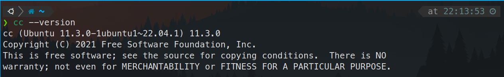

# 20230707 Learn C The Hardway lecture 0/1

第六期“一生一芯”学习记录，**仅供本人记录**使用，请勿作为参考

# Lecture 01

Ubuntu 22.04 预装gcc/gdb/c等调试器

Using cc --version 检查版本

gcc --version查看gcc环境，gdb --version查看gdb调试环境

# Lecture 02

Hello world!

使用之前搭建的nvim+tmux环境编写第一个C程序

通过make filename来编译程序（注意是make filename，并非make filename.c）

使用 ./执行编译之后的C程序

## 附加任务

1. 删除一个’;’，重新编译文件

注意到编辑器之前配置的语法检查功能生效，提升缺少’;’

重新编译之后cc报错

1. 使用for循环打印1 2 3 4 5

1. 运行man 3 printf

