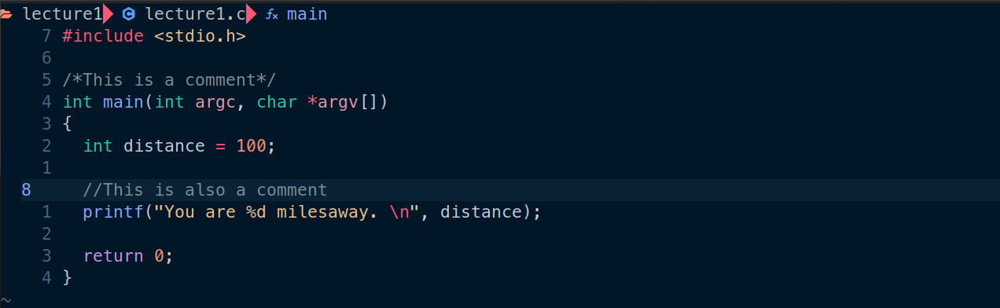

# 习题1. 打开尘封的编译器

Hello world!

使用之前搭建的nvim+tmux环境编写第一个C程序

通过make filename来编译程序（注意是make filename，并非make filename.c）

使用 ./执行编译之后的C程序

# 附加任务

- 删除一个’;’，重新编译文件
    
    
    
    注意到编辑器之前配置的语法检查功能生效，提升缺少’;’
    
    重新编译之后cc报错
    
    
    
- 使用for循环打印1 2 3 4 5
    
    
    
- 运行man 3 printf
    
    