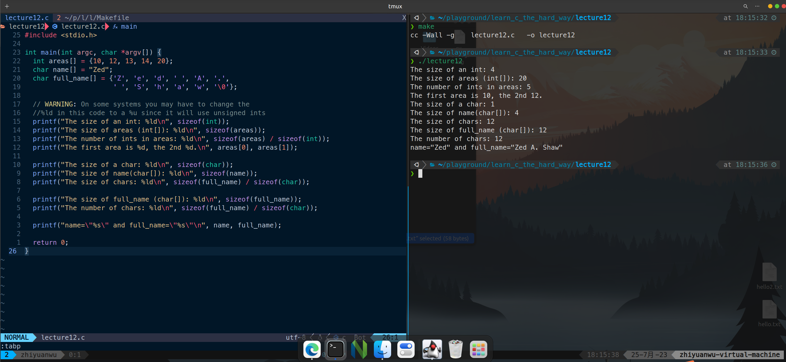

# 习题12. 数组和大小

按照课本内容录入代码

```c
#include <stdio.h>

int main(int argc, char *argv[]) {
  int areas[] = {10, 12, 13, 14, 20};
  char name[] = "Zed";
  char full_name[] = {'Z', 'e', 'd', ' ', 'A', '.',
                      ' ', 'S', 'h', 'a', 'w', '\0'};

  // WARNING: On some systems you may have to change the
  //%ld in this code to a %u since it will use unsigned ints
  printf("The size of an int: %ld\n", sizeof(int));
  printf("The size of areas (int[]): %ld\n", sizeof(areas));
  printf("The number of ints in areas: %ld\n", sizeof(areas) / sizeof(int));
  printf("The first area is %d, the 2nd %d.\n", areas[0], areas[1]);

  printf("The size of a char: %ld\n", sizeof(char));
  printf("The size of name(char[]): %ld\n", sizeof(name));
  printf("The size of chars: %ld\n", sizeof(full_name) / sizeof(char));

  printf("The size of full_name (char[]): %ld\n", sizeof(full_name));
  printf("The number of chars: %ld\n", sizeof(full_name) / sizeof(char));

  printf("name=\"%s\" and full_name=\"%s\"\n", name, full_name);

  return 0;
}
```

编写Makefile文件

```makefile
CFLAGS = -Wall -g
all: lecture12

clean:
	rm -f lecture12
```

编译，运行，查看结果



在这段代码中，创建了一些包含不同类型的数组。由于数组是C语言工作原理的核心，所以可以用很多种不同的方法来创建数组。这里使用了

```c
type name[] = {initializer}
```

这个语法的意思是，我需要一个类型为type的数组，并将其初始化为{…}

C语言看到这行代码时，会做以下事情：

- 查看类型，发现程序中需要的类型是int
- 查看[]，发现数组长度并没有给出
- 查看初始化{10, 12, 13, 14, 20}于是要将这5个整数放入数组中
- 在本机创建一个内存区域，用来一次保存这5个整数
- 将你选择的变量名称areas指定到这一内存位置

<aside>
💡 使用sizeof可以查询某些东西的大小

</aside>

# 破坏程序

- 删除full_name尾部的’\0’并重新运行程序。再在调试器下运行一次，现在将full_name的定义放到main的顶部，areas前面。在调试器下运行几次，看看会不会得到新的出错信息。有时候你可能会幸运到一个错误都看不到
    
    去掉\0
    
    
    
    移动full_name位置，给数组初始化之前
    
    
    
    初始化之后
    
    
    
    确实没有看到错误
    
- 尝试打印areas[10]而非areas[0] ，并看看调试器有什么意见
    
    
    
- 多做几个类似的尝试，在name和full_name上也尝试一下
    
    C语言貌似不会检查下标越界的问题
    
    
    

# 附加任务

- 尝试使用areas[0] = 100; 这样的语句对数组areas中的元素进行赋值。
    
    正常赋值，打印
    
- 尝试对name和full_name的元素进行赋值
    
    
    
    对int数组直接赋值就会改变对应的值，char则会显示对应值对应的ASCII表值
    
- 尝试把areas中的一个元素设置成name中的一个字符
    
    