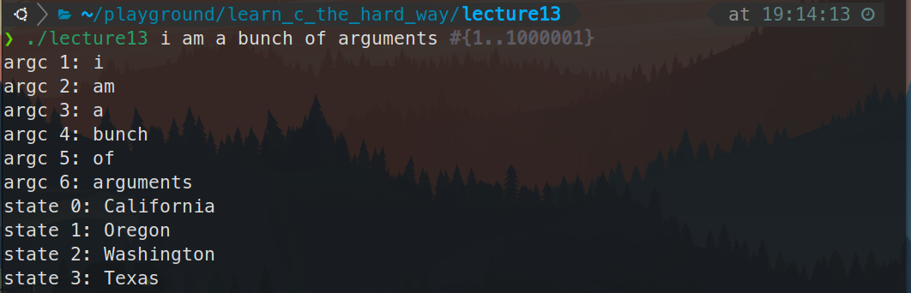

# 习题13. for循环和字符串数组

按照课本示例代码编写代码

```c
#include <stdio.h>

int main(int argc, char *argv[]) {
  int i = 0;
  // go through each string in argv
  // why am I skipping argv[0]
  for (i = 1; i < argc; i++) {
    printf("argc %d: %s\n", i, argv[i]);
  }

  // let's make our own array of strings
  char *states[] = {"California", "Oregon", "Washington", "Texas"};
  int num_states = 4;
  for (i = 0; i < num_states; i++) {
    printf("state %d: %s\n", i, states[i]);
  }
  return 0;
}
```

运行程序




字符串数组：

在C语言汇总，创建字符串数字的方式是，将char *str = “blah”语法和char str = {’b’, ‘l’, ‘a’, ‘h’}语法合并，从而构建出一个二维数组。第一层中每个字符串是一个元素，第二层中字符串中的每个字符是一个元素

# 破坏程序

- 将i初始化为0，看会发生什么事情。你还需要调整argc，还是说不调整程序也能正常运行？为什么基于0的索引在这里没有问题？
    
    并不需要调整argc，因为第一个参数（下标是0那个）就是文件名
    
    ```bash
    ❯ ./lecture13 #i am a bunch of arguments #{1..1000001}
    argc 0: ./lecture13
    ```
    
- 将num_states设为错误值，让它的值过大，看会发生什么事情
    
    出现了段错误
    
    ```bash
    ❯ ./lecture13 #i am a bunch of arguments #{1..1000001}
    argc 0: ./lecture13
    state 0: California
    state 1: Oregon
    state 2: Washington
    state 3: Texas
    
    ❯ ./lecture13 i am a bunch of arguments #{1..1000001} 
    argc 0: ./lecture13
    argc 1: i
    argc 2: am
    argc 3: a
    argc 4: bunch
    argc 5: of
    argc 6: arguments
    state 0: California
    state 1: Oregon
    state 2: Washington
    state 3: Texas
    ```
    
- 将num_states设为错误值，让它的值过大，看看会发生什么事情
    
    段错误
    
    ```bash
    ❯ ./lecture13 #i am a bunch of arguments #{1..1000001}
    argc 0: ./lecture13
    state 0: California
    state 1: Oregon
    state 2: Washington
    state 3: Texas
    [1]    12503 segmentation fault (core dumped)  ./lecture13
    ```
    

# 附加任务

- 阅读关于NULL的资料，试着将其用作states数组的某个元素，看看会打印出什么
    
    ```bash
    ❯ ./lecture13 #i am a bunch of arguments #{1..1000001}
    argc 0: ./lecture13
    state 0: California
    state 1: Oregon
    state 2: (null)
    state 3: Texas
    ```
    
- 看看你能不能在打印出二者之前，将states数组中的一个元素赋值给argv数组，再反过来试一下
    
    是可以的
    
    
    
    
    
    
    
    