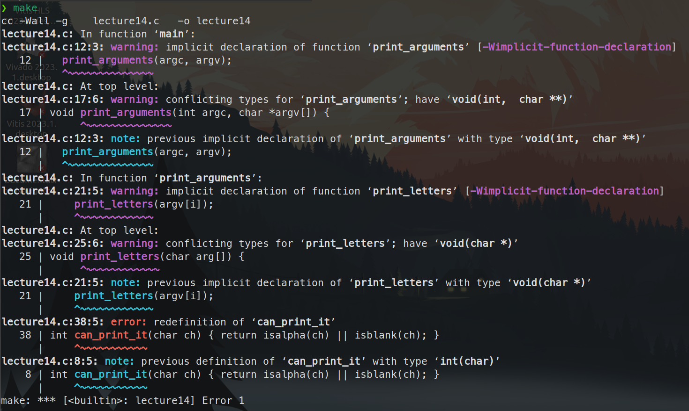

# 习题14. 编写和使用函数

按照课本内容编写代码

```c
#include <ctype.h>
#include <stdio.h>

// forward declarations
int can_print_it(char ch);
void print_letters(char arg[]);

void print_arguments(int argc, char *argv[]) {
  int i = 0;

  for (i = 0; i < argc; i++) {
    print_letters(argv[i]);
  }
}

void print_letters(char arg[]) {
  int i = 0;

  for (i = 0; arg[i] != '\0'; i++) {
    char ch = arg[i];

    if (can_print_it(ch)) {
      printf("'%c' == %d ", ch, ch);
    }
  }
  printf("\n");
}

int can_print_it(char ch) { return isalpha(ch) || isblank(ch); }

int main(int argc, char *argv[]) {

  print_arguments(argc, argv);

  return 0;
}
```

执行命令

```c
❯ ./lecture14 hi this is cool
'l' == 108 'e' == 101 'c' == 99 't' == 116 'u' == 117 'r' == 114 'e' == 101 
'h' == 104 'i' == 105 
't' == 116 'h' == 104 'i' == 105 's' == 115 
'i' == 105 's' == 115 
'c' == 99 'o' == 111 'o' == 111 'l' == 108 
                                                                                                                              at 23:25:31  
❯ ./lecture14 "I go 3 spaces"
'l' == 108 'e' == 101 'c' == 99 't' == 116 'u' == 117 'r' == 114 'e' == 101 
'I' == 73 ' ' == 32 'g' == 103 'o' == 111 ' ' == 32 ' ' == 32 's' == 115 'p' == 112 'a' == 97 'c' == 99 'e' == 101 's' == 115
```

## 破坏程序

- 去除前置声明，以此来迷惑编译器，促使它抱怨找不到函数
    
    如下即可实现，把函数声明去除即可
    
    ```c
    ❯ cat lecture14.c            
    #include <ctype.h>
    #include <stdio.h>
    
    // forward declarations
    // int can_print_it(char ch);
    // void print_letters(char arg[]);
    
    int can_print_it(char ch) { return isalpha(ch) || isblank(ch); }
    
    int main(int argc, char *argv[]) {
    
      print_arguments(argc, argv);
    
      return 0;
    }
    
    void print_arguments(int argc, char *argv[]) {
      int i = 0;
    
      for (i = 0; i < argc; i++) {
        print_letters(argv[i]);
      }
    }
    
    void print_letters(char arg[]) {
      int i = 0;
    
      for (i = 0; arg[i] != '\0'; i++) {
        char ch = arg[i];
    
        if (can_print_it(ch)) {
          printf("'%c' == %d ", ch, ch);
        }
      }
      printf("\n");
    }
    
    int can_print_it(char ch) { return isalpha(ch) || isblank(ch); }
    ```
    
    
    
- 当你在main函数中调用print_arguments时对argc加1，这样就越过了argv数组的最后一个参数
    
    出现了段错误
    
    ```bash
    ./lecture14     
    'l' == 108 'e' == 101 'c' == 99 't' == 116 'u' == 117 'r' == 114 'e' == 101 
    [1]    42751 segmentation fault (core dumped)  ./lecture14
    ```
    

## 附加任务

- 重做这些函数，减少函数的个数
    
    去掉can_print_it()这个函数
    
    ```c
    #include <ctype.h>
    #include <stdio.h>
    
    // forward declarations
    void print_letters(char arg[]);
    void print_arguments(int argc, char *argv[]);
    
    int main(int argc, char *argv[]) {
    
      print_arguments(argc, argv);
    
      return 0;
    }
    
    void print_arguments(int argc, char *argv[]) {
      int i = 0;
    
      for (i = 0; i < argc; i++) {
        print_letters(argv[i]);
      }
    }
    
    void print_letters(char arg[]) {
      int i = 0;
    
      for (i = 0; arg[i] != '\0'; i++) {
        char ch = arg[i];
    
        if ((isalpha(ch) || isblank(ch))) {
          printf("'%c' == %d ", ch, ch);
        }
      }
      printf("\n");
    }
    ```
    
    命令行输出
    
    ```bash
    ❯ ./lecture14 hi this is cool                 
    'l' == 108 'e' == 101 'c' == 99 't' == 116 'u' == 117 'r' == 114 'e' == 101 
    'h' == 104 'i' == 105 
    't' == 116 'h' == 104 'i' == 105 's' == 115 
    'i' == 105 's' == 115 
    'c' == 99 'o' == 111 'o' == 111 'l' == 108
    ```
    
- 让print_arguments函数调用strlen函数，从而获知每个参数字符串的长度，再把长度作为参数传递给print_letters。然后重写print_letters，使它只处理这个固定长度，这样就不需要依赖’\0’终止符了。
    
    
    
- 用man查询isalpha和isblank的函数信息。
    
    