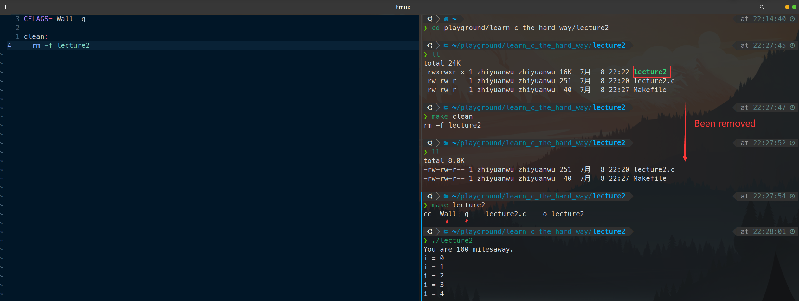

# 习题2. 使用Makefile构建程序

构建Makefile文件，加入clean功能，同时打开显示所有警告与调试功能（-Wall -g）

注意clean后面的块必须使用制表符，不能使用空格

# 破坏程序

比如使用空格来代替制表符

Makefile:4: *** missing separator. stop. 大概就是有空格了（x）

# 附加任务

- 创建一个all: lecture2 目标，实现直接输入make即可构建文件
    
    
    
- 阅读 man make
    
    
    
- 阅读 man cc，找到-Wall和-g标志功能的更多信息
    
    man cc，之后输入/查找特定字符串
    
    
    
    -g
    
    
    
- 改进一下
    
    加入.PHONY等
    
- 找出另一个Makefile文件，尝试弄懂功能
    
    暂无