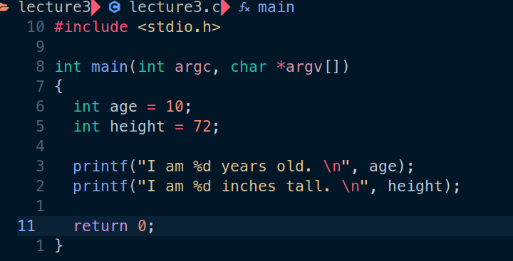

# 习题3. 格式化打印

输入代码

使用make构建文件

上网查找printf支持的所有转义字符与格式化序列

[C 库函数 – printf() | 菜鸟教程 (runoob.com)](https://www.runoob.com/cprogramming/c-function-printf.html)

# 破坏程序：

- 将age从第一个printf中删除
    
    
    
    打印出非常不切实际的数，同时注意到gcc与之前配置的语法检测都给出了warning
    
- printf恢复到原来的样子，取消对age的赋值
    
    
    
    同样打印出了非常不切实际的数，同样注意到了warning
    

# 附加任务

- 找出尽可能多的破坏ex3.c的方法
    
    将%d改为%lf或%f等其他错误的转义字符，使用错误的变量类型定义如int改为char等
    
- 运行man 3 printf
    
    同样输入/查找特定字符
    
    
    
- 将ex3加入Makefile的all中
    
    
    
- 将ex3加入clean列表中
    
    