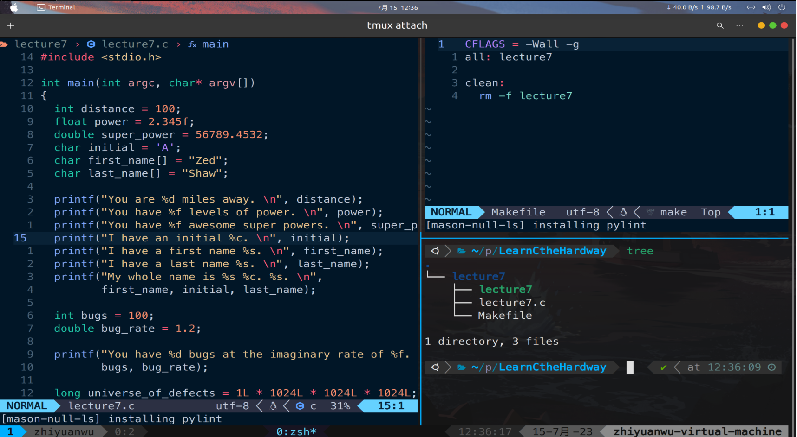

# 习题7. 变量和类型

### 根据书内容编写文件与Makefile，主要是一些输入输出的内容

<aside>
💡 特别需要注意的是C语言中的字符其实就是int，可以参与到运算中

</aside>

执行效果，与课本中相同

# 破坏程序

和之前一样，试着为printf函数传入错误的参数，破坏它的输出。看看用%s和%c打印出nul_byte变量时分别会输出什么结果。代码被破坏以后，在调试器中运行它，看它会跟你说什么。

- 使用%c来打印，执行出问题，没有打印出任何东西
    
    
    
- 使用%s来打印
    
    可以看到gcc和clang（自己配置的nvim的lsp）都报了warning
    
    
    
    结果也是错的，打印出了null
    
    
    

# 附加题

- 为universe_of_defects赋不同大小的值，直到从编译器得到警告信息为止。
    
    可以看到数值过大的时候gcc给出warning
    
    
    
- 这些庞大数字实际上打印出的是什么？
    
    运行结果发现溢出
    
    
    
- 把long换成unsigned long，试着找到一个太大的数
    
    下表给出了一些常见的数据范围，注意使用过程中不要超过这些范围，否则会发生溢出
    
    
    
    
    
- 上网查查unsigned的功能是什么？
    
    unsigned可以扩展非unsinged的范围，但是只能表示正数