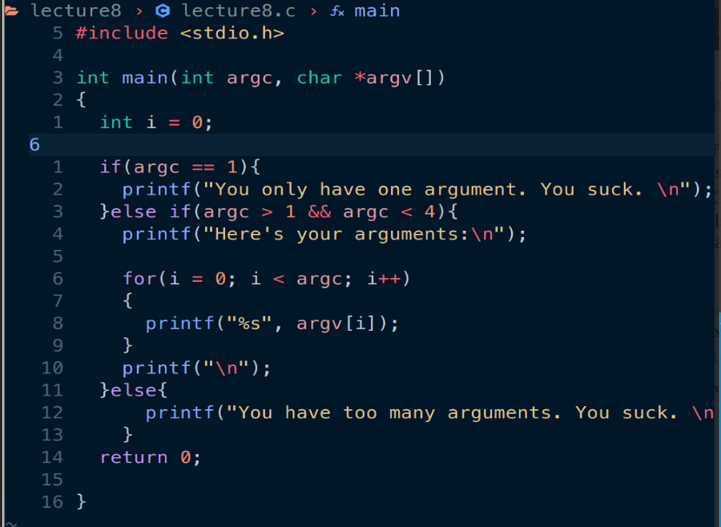

# 习题8. if, else-if, else

根据要求编写源代码

其中 argc为命令行传入参数的个数，argv[]内部以此存储了参数。需要注意的是比如执行./lecture8的时候，lecture8本身也是一个参数。

编写对应的Makefile文件，实现一键make编译生成可执行文件

传入参数，执行文件，并使用之前学到的gdb调试器内容设置断点查看参数的值等：

# 破坏程序

这个例子不容易出错，因为它太简单了，不过可以试着把if语句里的测试条件乱改试一下。

- 移除结尾的else，这样程序就永远不会捕捉到边界情况了。
    
    
    
- 把&&换成||，用“或”代替“与”测试，看看结果是怎样的。
    
    AND become OR in if statement.  So, if number of arguments less than 1. First comparison can give the result of “You only have one argument. You suck.” and the programm exit with return code 0.
    
    However, if the number of arguments more than 4, the program still gives out the number instead of “You have too many arguments. You suck.”  The last edge state seems to be “shorted”.
    
    
    

# 附加任务

- 你已经简单学习了&&，它的功能是执行“与”比较，再上网查一下各种不同的布尔运算符
    
    Boolean operators in C: && AND, || OR, ! NOT
    
    
    
- 多写写判断语句，看看你还能玩出什么花来。
    
    复用破坏程序第二条
    
- 第一个条件判断真的是对的吗？对你来说，第一个参数和第一个用户输入的参数是不一样的，把这里修改正确
    
    Change the program to print the first user input parameter.
    
    