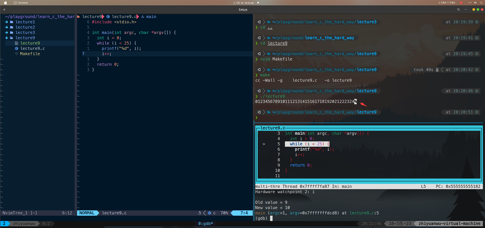

# 习题9. while循环和布尔表达式

按照课本内容编写while循环内容，编写Makefile文件，并使用gdb调试器进行调试，查看程序行为：

注：gdb几个常见的tricks：

- 使用命令 layout asm 即可进入gdb的TUI界面（terminal user interface）
- 使用命令layout next可以切换不同的TUI界面（源代码，源代码+汇编，源代码+汇编+寄存器，汇编+寄存器）
- 不输入命令直接摁Enter默认执行上一次的指令
- 可以使用缩写，诸如b为break等

# 破坏程序

让while循环出错的方法有好几种，所以我建议如果不是不得已，就别使用它。下面展示了几种简单的破坏方法。

- 忘记初始化第一个int i，循环可能完全不会运行，也可能会运行很长时间，这取决于开始时i的值
- 忘记初始化第二个循环中的i，于是它维持了在第一个循环结束时的值。现在你的第二个循环可能会运行，也可能不会运行
- 忘记在循环底部进行i++增值，你将会得到一个无限循环，这是编程历史前一二十年人们常见的最可怕的问题之一。

特别的，对于忘记初始化的情况，可以在gdb调试的时候看出来：

i如果忘记初始化赋值，里面的garbage可能是任何数：

# 附加任务

- 使用i--让循环反向计数，从25开始，计数到0
    
    
    
- 使用已经学过的知识，再写几个复杂的while循环
    
    输出乘法表
    
    