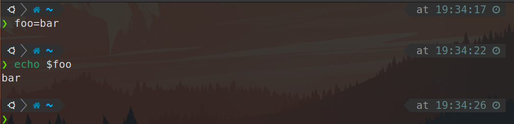

# Missing Semester 02 Shell Tools and Scripting

# 1. Shell脚本

Shell是可编程的，可以像一个编程语言来对待他，比如可以通过如下手段来给变量赋值，并使用这个变量。

```bash
foo=bar
echo "$foo"
# prints barecho '$foo'
# prints $foo
```



<aside>
💡 注意空格，foo = bar是不行的，shell会认为foo是第一个参数，而不是赋值

</aside>


如上一个练习题中看到的，使用””和’’来表达字符串时会有不同的效果：

- 双引号：将字符串内有特殊含义的字符（比如变量，运算符等）展开为对应值
- 单引号：单纯的打印所有字符


bash中也是可以编写函数的，同样有`if`, `case`, `while` 和`for`这样的流程控制

```bash
mcd(){mkdir -p "$1"
    cd "$1"
}
```


注意这里面的$1类似C中的*argv[]，它从命令行中接收参数，摘录讲义中关于此种参数的定义

- `$0` - Name of the script
- `$1` to `$9` - Arguments to the script. `$1` is the first argument and so on.
- `$@` - All the arguments
- `$#` - Number of arguments
- `$?` - Return code of the previous command
- `$$` - Process identification number (PID) for the current script
- `!!` - Entire last command, including arguments. A common pattern is to execute a command only for it to fail due to missing permissions; you can quickly re-execute the command with sudo by doing `sudo !!`
- `$_` - Last argument from the last command. If you are in an interactive shell, you can also quickly get this value by typing `Esc` followed by `.` or `Alt+.`

Shell脚本通过STDOUT来输出，通过STDERR来抛出错误同时返回一个代表错误的返回值，类似C，返回值为0一般代表正常，非0值一般代表出错

注意逻辑运算符是短路的（对于&&来说执行到第一个错误的命令就退出。对于||来说则正相反，执行到第一个正确的命令就退出），如下面的例子所展示的。如果只是单纯的想连接两个命令，可以使用分号;来连接

```bash
false || echo "Oops, fail"
# Oops, fail

true || echo "Will not be printed"
#

true && echo "Things went well"
# Things went well

false && echo "Will not be printed"
#

true ; echo "This will always run"
# This will always run

false ; echo "This will always run"
# This will always run
```

变量替换（*command substitution*）

<aside>
💡 $(CMD)来执行变量时，输出结果会替换掉$(CMD)

</aside>

比如执行`for file in $(ls)` ，shell首先将调用`ls` ，然后遍历得到的这些返回值

进程替换（*process substitution*）

<aside>
💡 `<( CMD )` 会执行 `CMD` 并将结果输出到一个临时文件中，并将 `<( CMD )` 替换成临时文件名

</aside>

`diff <(ls foo) <(ls bar)` 会显示文件夹 `foo` 和 `bar` 中文件的区别

比如写一个小程序来统计某路径下的文件字节数

```bash
#!/bin/bash

wordcount(){
cd "$1"
for file in $(ls) 
do
  wc -w $file
done
cd -
}
```


```bash
#!/bin/bash

echo "Starting program at $(date)" # Date will be substituted

echo "Running program $0 with $# arguments with pid $$"

for file in "$@"; do
    grep foobar "$file" > /dev/null 2> /dev/null
    # When pattern is not found, grep has exit status 1
    # We redirect STDOUT and STDERR to a null register since we do not care about them
    if [[ $? -ne 0 ]]; then
        echo "File $file does not have any foobar, adding one"
        echo "# foobar" >> "$file"
    fi
done
```

这个例子给出了更详细的使用方法

<aside>
💡 在bash中进行比较时，尽量使用双方括号 `[[ ]]` 而不是单方括号 `[ ]`，这样会降低犯错的几率

</aside>

# 2. **通配**

通配符：使用`?` 和 `*` 来匹配一个或任意个字符。

例如，对于文件`foo`, `foo1`, `foo2`, `foo10` 和 `bar`, `rm foo?`这条命令会删除`foo1` 和 `foo2` ，而`rm foo*` 则会删除除了`bar`之外的所有文件。

花括号：括号`{}` ， 当有一系列的指令，其中包含一段公共子串时，可以用花括号来自动展开这些命令。这在批量移动或转换文件时非常方便。

```bash
convert image.{png,jpg}
# 会展开为
convert image.png image.jpg

cp /path/to/project/{foo,bar,baz}.sh /newpath
# 会展开为
cp /path/to/project/foo.sh /path/to/project/bar.sh /path/to/project/baz.sh /newpath

# 也可以结合通配使用
mv *{.py,.sh} folder
# 会移动所有 *.py 和 *.sh 文件

mkdir foo bar

# 下面命令会创建foo/a, foo/b, ... foo/h, bar/a, bar/b, ... bar/h这些文件
touch {foo,bar}/{a..h}
touch foo/x bar/y
# 比较文件夹 foo 和 bar 中包含文件的不同
diff <(ls foo) <(ls bar)
# 输出
# < x
# ---
# > y
```

命令行不止可以执行基于命令行的脚本，指定了运行程序也可以执行诸如Python等其他语言写成的脚本。在#!行标注环境是一个好的习惯

```python
#!/usr/local/bin/python
import sys
for arg in reversed(sys.argv[1:]):
    print(arg)
```

<aside>
💡 函数只能与shell使用相同的语言，脚本可以使用任意语言。因此在脚本中包含 `shebang` 是很重要的

</aside>

函数会在当前的shell环境中执行，脚本会在单独的进程中执行。因此，函数可以对环境变量进行更改，比如改变当前工作目录，脚本则不行。脚本需要使用 `[export](https://man7.org/linux/man-pages/man1/export.1p.html)` 将环境变量导出，并将值传递给环境变量。

# 3. 查找

所有的类UNIX系统都包含一个名为 `[find](https://man7.org/linux/man-pages/man1/find.1.html)` 的工具，`find`命令会递归地搜索符合条件的文件

```bash
# 查找所有名称为src的文件夹
find . -name src -type d
# 查找所有文件夹路径中包含test的python文件
find . -path '*/test/*.py' -type f
# 查找前一天修改的所有文件
find . -mtime -1
# 查找所有大小在500k至10M的tar.gz文件
find . -size +500k -size -10M -name '*.tar.gz'
```


<aside>
💡 注意.与*的不同

</aside>


<aside>
💡 还有诸如fd，locate等查找工具，也非常好用

</aside>

[https://github.com/sharkdp/fd](https://github.com/sharkdp/fd)

[locate(1) - Linux manual page (man7.org)](https://man7.org/linux/man-pages/man1/locate.1.html)

## **查找文本**

[grep(1) - Linux manual page (man7.org)](https://www.man7.org/linux/man-pages/man1/grep.1.html)

```bash
# Find all python files where I used the requests library
rg -t py 'import requests'
# Find all files (including hidden files) without a shebang line
rg -u --files-without-match "^#\!"
# Find all matches of foo and print the following 5 lines
rg foo -A 5
# Print statistics of matches (# of matched lines and files )
rg --stats PATTERN
```


对于已经执行过的Shell脚本，可以使用history和rg通过管道相连接来实现查询已经输入过的命令

```bash
history | grep find
```

同样可以使用`Ctrl+R` 来查找命令，而最近的zsh插件已经支持了根据历史自动补全命令，在oh-my-zsh中使用autosuggestion插件即可实现


**在Shell中导航**

可以使用以下工具在Shell中快速导航

[https://github.com/clvv/fasd](https://github.com/clvv/fasd)

[https://github.com/wting/autojump](https://github.com/wting/autojump)

---

# Exercise

1. Read `[man ls](https://www.man7.org/linux/man-pages/man1/ls.1.html)` and write an `ls` command that lists files in the following manner
    - Includes all files, including hidden files
    - Sizes are listed in human readable format (e.g. 454M instead of 454279954)
    - Files are ordered by recency
    - Output is colorized
    
    A sample output would look like this
    
    ```bash
     -rw-r--r--   1 user group 1.1M Jan 14 09:53 baz
     drwxr-xr-x   5 user group  160 Jan 14 09:53 .
     -rw-r--r--   1 user group  514 Jan 14 06:42 bar
     -rw-r--r--   1 user group 106M Jan 13 12:12 foo
     drwx------+ 47 user group 1.5K Jan 12 18:08 ..
    ```
    


使用ll命令即可实现（ls -l）


1.  Write bash functions `marco` and `polo` that do the following. Whenever you execute `marco` the current working directory should be saved in some manner, then when you execute `polo`, no matter what directory you are in, `polo` should `cd` you back to the directory where you executed `marco`. For ease of debugging you can write the code in a file `marco.sh` and (re)load the definitions to your shell by executing `source marco.sh`.

```bash
#!/usr/bin/env bash

marco(){
  Path=$(pwd)
  echo $Path
}

polo(){
  cd $Path
}
```

1. Say you have a command that fails rarely. In order to debug it you need to capture its output but it can be time consuming to get a failure run. Write a bash script that runs the following script until it fails and captures its standard output and error streams to files and prints everything at the end. Bonus points if you can also report how many runs it took for the script to fail.
    
    ```bash
     *#!/usr/bin/env bash*
    n**=$((** RANDOM **%** 100 **))if** **[[** n -eq 42 **]]**; **then**
        echo "Something went wrong"
        **>**&2 echo "The error was using magic numbers"
        exit 1
     **fi**
    
     echo "Everything went according to plan"
    ```
    

使用一个while循环即可完成这个功能，需要注意的是判断条件要离中括号有一个空格的距离，循环的变量要用双括号包围起来

```bash
#!/usr/bin/env bash

bash wrong.sh
count=1;
while [[ $? -eq 0 ]];
do
  ((count++))
  echo "Everything is right"
  bash wrong.sh
done
  echo "Oops, Wrong, in "$count" times"
```


1. As we covered in the lecture `find`’s `-exec` can be very powerful for performing operations over the files we are searching for. However, what if we want to do something with **all** the files, like creating a zip file? As you have seen so far commands will take input from both arguments and STDIN. When piping commands, we are connecting STDOUT to STDIN, but some commands like `tar` take inputs from arguments. To bridge this disconnect there’s the `[xargs](https://www.man7.org/linux/man-pages/man1/xargs.1.html)` command which will execute a command using STDIN as arguments. For example `ls | xargs rm` **will delete the files in the current directory.**
    
    Your task is to write a command that recursively finds all HTML files in the folder and makes a zip with them. Note that your command should work even if the files have spaces (hint: check `-d` flag for `xargs`).
    

目前没有html文件，以查询C文件并压缩为例代替

```bash
find . -name "*.c" | xargs -d '\n' tar -czf hello.tar;
```

当然也可以通过这种方法创建HTML文件

```bash
touch {1..10}.html
```

注意，可以使用xargs的-t指令查看xargs做了什么


1. (Advanced) Write a command or script to recursively find the most recently modified file in a directory. More generally, can you list all files by recency?

```bash
find . -type f -print0 | xargs -0 ls -lt | head -1
```

当文件较多的时候需要增加一个-mmin条件

```bash
find . -type f -mmin -60 -print0 | xargs -0 ls -lt | head -10
```