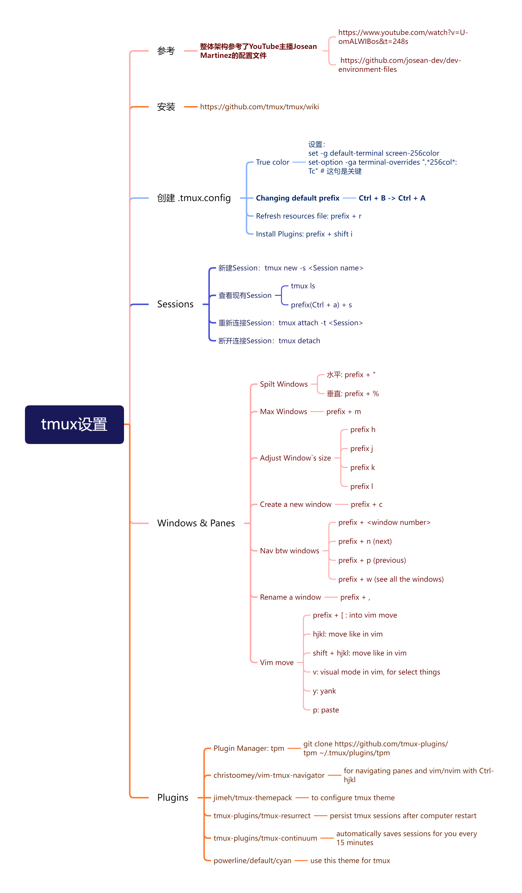

# Missing Semester 05 Command-line Environment

# 1. Job Control

How to stop a program

```bash
sleep n #sleeps for n seconds
```

Ctrl+C: 发送一个SIGINT给程序来使程序停下

使用Man Signal查看手册

SIGINT:打断程序

SIGSTOP:暂停执行任务

SIGCONT:继续执行任务

SIGCONT:退出程序 Ctrl+\

<aside>
💡 如果ctrl c不管用了可以试试其他的（比如ctrl \）

</aside>

同样有一些signal是无法被程序获取的，比如SIGKILL

Ctrl+Z使程序suspend，即程序在后台且停止运行

使用jobs可以查看当前运行的任务

使用bg+%number可以使stop的程序continue

使用kill可以结束进程

使用nohup可以避免关闭terminal时terminal发送的-HUP命令终止程序，但如果使用kill则无论如何都会被结束

# 2. Terminal Multiplxer

使用终端复用器可以复用多个终端，同时也可以创建多个工作空间

tmux的层级：

Session

Windows

Panes

tmux启动时会使用一个新的不同的进程，不关闭tmux进程的话tmux的进程会始终运行，不用担心中途中断。

<aside>
💡 tmux的默认快捷键需要一点时间去吸收

</aside>

tmux new -t name新建一个名称为name的session

tmux ls 显示所有tmux进程

tmux a -t name 重新连接（attach）到名称为name的session

prefix + p 切换到上一个Window

prefix + n 切换到下一个Window

prefix + ,   重命名一个Window

prefix + z zoom某一个窗口，再执行一次可以回到最开始的界面

事实上我的开发环境高度依赖于tmux，我对tmux进行了一定程度上的自定义，包括更换了主题，安装了一些插件，启用了vimmotion以及使用了自定义的快捷键，包含在这个Repo中

[ZyWCN1998/MyDevEnvFile: My Neovim & TMUX & Terminal setup on Ubuntu 22.04 LTS for C/C++/Verilog/System Verilog Development (github.com)](https://github.com/ZyWCN1998/MyDevEnvFile)

- 其中的tmux快捷键设置
    

    

# 3. Dotfiles

alias 简称：自定义一串常用的长命令的简称

```bash
alias alias_name="command_to_alias arg1 arg2" #single argument
# Make shorthands for common flags
alias ll="ls -lh"
```

一些常用的alias

alias name，查看这个name是哪个操作的简称

```bash
# Make shorthands for common flags
alias ll="ls -lh"

# Save a lot of typing for common commands
alias gs="git status"
alias gc="git commit"
alias v="vim"

# Save you from mistyping
alias sl=ls

# Overwrite existing commands for better defaults
alias mv="mv -i"           # -i prompts before overwrite
alias mkdir="mkdir -p"     # -p make parent dirs as needed
alias df="df -h"           # -h prints human readable format

# Alias can be composed
alias la="ls -A"
alias lla="la -l"

# To ignore an alias run it prepended with \
\ls
# Or disable an alias altogether with unalias
unalias la

# To get an alias definition just call it with alias
alias ll
# Will print ll='ls -lh'
```

dotfile

用来加载一些用户自定义设置的文件，常见的工具有很多是通过使用这种dotfile来进行管理用户自定义内容的，比如

- `bash` - `~/.bashrc`, `~/.bash_profile`
- `git` - `~/.gitconfig`
- `vim` - `~/.vimrc` and the `~/.vim` folder
- `ssh` - `~/.ssh/config`
- `tmux` - `~/.tmux.conf`
- 这里是我自己开发环境的.zshrc文件和.tmux文件，nvim是使用.config文件夹里的nvim文件夹来管理的
    
    ```bash
    # Enable Powerlevel10k instant prompt. Should stay close to the top of ~/.zshrc.
    # Initialization code that may require console input (password prompts, [y/n]
    # confirmations, etc.) must go above this block; everything else may go below.
    if [[ -r "${XDG_CACHE_HOME:-$HOME/.cache}/p10k-instant-prompt-${(%):-%n}.zsh" ]]; then
      source "${XDG_CACHE_HOME:-$HOME/.cache}/p10k-instant-prompt-${(%):-%n}.zsh"
    fi
    
    # If you come from bash you might have to change your $PATH.
    # export PATH=$HOME/bin:/usr/local/bin:$PATH
    
    # Path to your oh-my-zsh installation.
    export ZSH="$HOME/.oh-my-zsh"
    
    # Set name of the theme to load --- if set to "random", it will
    # load a random theme each time oh-my-zsh is loaded, in which case,
    # to know which specific one was loaded, run: echo $RANDOM_THEME
    # See https://github.com/ohmyzsh/ohmyzsh/wiki/Themes
    ZSH_THEME="powerlevel10k/powerlevel10k"
    
    # Set list of themes to pick from when loading at random
    # Setting this variable when ZSH_THEME=random will cause zsh to load
    # a theme from this variable instead of looking in $ZSH/themes/
    # If set to an empty array, this variable will have no effect.
    # ZSH_THEME_RANDOM_CANDIDATES=( "robbyrussell" "agnoster" )
    
    # Uncomment the following line to use case-sensitive completion.
    # CASE_SENSITIVE="true"
    
    # Uncomment the following line to use hyphen-insensitive completion.
    # Case-sensitive completion must be off. _ and - will be interchangeable.
    # HYPHEN_INSENSITIVE="true"
    
    # Uncomment one of the following lines to change the auto-update behavior
    # zstyle ':omz:update' mode disabled  # disable automatic updates
    # zstyle ':omz:update' mode auto      # update automatically without asking
    # zstyle ':omz:update' mode reminder  # just remind me to update when it's time
    
    # Uncomment the following line to change how often to auto-update (in days).
    # zstyle ':omz:update' frequency 13
    
    # Uncomment the following line if pasting URLs and other text is messed up.
    # DISABLE_MAGIC_FUNCTIONS="true"
    
    # Uncomment the following line to disable colors in ls.
    # DISABLE_LS_COLORS="true"
    
    # Uncomment the following line to disable auto-setting terminal title.
    # DISABLE_AUTO_TITLE="true"
    
    # Uncomment the following line to enable command auto-correction.
    # ENABLE_CORRECTION="true"
    
    # Uncomment the following line to display red dots whilst waiting for completion.
    # You can also set it to another string to have that shown instead of the default red dots.
    # e.g. COMPLETION_WAITING_DOTS="%F{yellow}waiting...%f"
    # Caution: this setting can cause issues with multiline prompts in zsh < 5.7.1 (see #5765)
    # COMPLETION_WAITING_DOTS="true"
    
    # Uncomment the following line if you want to disable marking untracked files
    # under VCS as dirty. This makes repository status check for large repositories
    # much, much faster.
    # DISABLE_UNTRACKED_FILES_DIRTY="true"
    
    # Uncomment the following line if you want to change the command execution time
    # stamp shown in the history command output.
    # You can set one of the optional three formats:
    # "mm/dd/yyyy"|"dd.mm.yyyy"|"yyyy-mm-dd"
    # or set a custom format using the strftime function format specifications,
    # see 'man strftime' for details.
    # HIST_STAMPS="mm/dd/yyyy"
    
    # Would you like to use another custom folder than $ZSH/custom?
    # ZSH_CUSTOM=/path/to/new-custom-folder
    
    # Which plugins would you like to load?
    # Standard plugins can be found in $ZSH/plugins/
    # Custom plugins may be added to $ZSH_CUSTOM/plugins/
    # Example format: plugins=(rails git textmate ruby lighthouse)
    # Add wisely, as too many plugins slow down shell startup.
    plugins=(git zsh-autosuggestions zsh-syntax-highlighting)
    
    source $ZSH/oh-my-zsh.sh
    
    # User configuration
    
    # export MANPATH="/usr/local/man:$MANPATH"
    
    # You may need to manually set your language environment
    # export LANG=en_US.UTF-8
    
    # Preferred editor for local and remote sessions
    # if [[ -n $SSH_CONNECTION ]]; then
    #   export EDITOR='vim'
    # else
    #   export EDITOR='mvim'
    # fi
    
    # Compilation flags
    # export ARCHFLAGS="-arch x86_64"
    
    # Set personal aliases, overriding those provided by oh-my-zsh libs,
    # plugins, and themes. Aliases can be placed here, though oh-my-zsh
    # users are encouraged to define aliases within the ZSH_CUSTOM folder.
    # For a full list of active aliases, run `alias`.
    #
    # Example aliases
    # alias zshconfig="mate ~/.zshrc"
    # alias ohmyzsh="mate ~/.oh-my-zsh"
    
    # To customize prompt, run `p10k configure` or edit ~/.p10k.zsh.
    [[ ! -f ~/.p10k.zsh ]] || source ~/.p10k.zsh
    ```
    
    ```bash
    set-environment -g PATH "/usr/local/sbin:/usr/local/bin:/usr/sbin:/usr/bin:/sbin:/bin:/usr/games:/usr/local/games:/snap/bin:snap/bin"
    set-option -g default-shell /usr/bin/zsh
    
    bind-key c new-window -c "#{pane_current_path}"
    bind-key % split-window -h -c "#{pane_current_path}"
    bind-key '"' split-window -c "#{pane_current_path}"
    
    set -g default-terminal "screen-256color"
    # tell Tmux that outside terminal supports true color
    set -ga terminal-overrides ",xterm-256color*:Tc"
    
    #unbind  prefix C-b to C-a
    set -g prefix C-a
    unbind C-b
    bind-key C-a send-prefix
    
    # keys for tmux windows
    unbind r
    bind r source-file ~/.tmux.conf
    
    bind -r j resize-pane -D 5
    bind -r k resize-pane -U 5
    bind -r l resize-pane -R 5
    bind -r h resize-pane -L 5
    
    bind -r m resize-pane -Z
    
    set -g mouse on
    
    set-window-option -g mode-keys vi
    
    bind-key -T copy-mode-vi 'v' send -X begin-selection # start selecting text with "v"
    bind-key -T copy-mode-vi 'y' send -X copy-selection # copy text with "y"
    
    unbind -T copy-mode-vi MouseDragEnd1Pane # don't exit copy mode when dragging with mouse
    
    # remove delay for exiting insert mode with ESC in Neovim
    set -sg escape-time 10
    
    # tpm plugin
    set -g @plugin 'tmux-plugins/tpm'
    
    # list of tmux plugins
    set -g @plugin 'christoomey/vim-tmux-navigator' # for navigating panes and vim/nvim with Ctrl-hjkl
    set -g @plugin 'jimeh/tmux-themepack' # to configure tmux theme
    set -g @plugin 'tmux-plugins/tmux-resurrect' # persist tmux sessions after computer restart
    set -g @plugin 'tmux-plugins/tmux-continuum' # automatically saves sessions for you every 15 minutes
    
    set -g @themepack 'powerline/default/cyan' # use this theme for tmux
    
    set -g @resurrect-capture-pane-contents 'on' # allow tmux-ressurect to capture pane contents
    set -g @continuum-restore 'on' # enable tmux-continuum functionality
    
    # Initialize TMUX plugin manager (keep this line at the very bottom of tmux.conf)
    run '~/.tmux/plugins/tpm/tpm'
    ```
    
    ```bash
    /home/zhiyuanwu/.config/nvim
    ├── init.lua
    ├── lua
    │   └── zhiyuanwu
    │       ├── core
    │       │   ├── colorscheme.lua
    │       │   ├── keymaps.lua
    │       │   └── options.lua
    │       ├── plugins
    │       │   ├── autopairs.lua
    │       │   ├── comment.lua
    │       │   ├── dashboard.lua
    │       │   ├── gitsigns.lua
    │       │   ├── lsp
    │       │   │   ├── lspconfig.lua
    │       │   │   ├── lspsaga.lua
    │       │   │   ├── mason.lua
    │       │   │   └── null-ls.lua
    │       │   ├── lualine.lua
    │       │   ├── nvim-cmp.lua
    │       │   ├── nvim-tree.lua
    │       │   ├── telescope.lua
    │       │   └── treesitter.lua
    │       └── plugins-setup.lua
    └── plugin
        └── packer_compiled.lua
    ```
    

<aside>
💡 如何去寻找好的设置？Github上查找并参考别人的dotfile，但不要陷入无休止的自定义中

</aside>

# 4. Remote Machines

SSH：reaching where we tell it go, display what remote shell display

比如github的Key

SSH Keys: Public Key & Private Key

ssh-keygen -o -a 100 -t name

copyfile：scp 从远程上拷贝文件，rsync从远程上拷贝文件夹

SSH config：存储用户自定义的ssh设置

<aside>
💡 在remote上使用tmux，同样可以让你在detach之后重连

</aside>

如何同时在远程和本地上同时使用tmux：保证远程的tmux和本地的tmux效果不同（快捷键，主题等）

---

# Exercise

## ****Job control****

1. From what we have seen, we can use some `ps aux | grep` commands to get our jobs’ pids and then kill them, but there are better ways to do it. Start a `sleep 10000` job in a terminal, background it with `Ctrl-Z` and continue its execution with `bg`. Now use `[pgrep](https://www.man7.org/linux/man-pages/man1/pgrep.1.html)` to find its pid and `[pkill](http://man7.org/linux/man-pages/man1/pgrep.1.html)` to kill it without ever typing the pid itself. (Hint: use the `af` flags).

使用ps -aux可以查看当前正在进行的程序和PID（process ID），类似任务管理器

```bash
❯ ps -aux
USER         PID %CPU %MEM    VSZ   RSS TTY      STAT START   TIME COMMAND
root           1  0.0  0.0 166916 12148 ?        Ss   18:33   0:01 /sbin/init au
root           2  0.0  0.0      0     0 ?        S    18:33   0:00 [kthreadd]
root           3  0.0  0.0      0     0 ?        I<   18:33   0:00 [rcu_gp]
root           4  0.0  0.0      0     0 ?        I<   18:33   0:00 [rcu_par_gp]
root           5  0.0  0.0      0     0 ?        I<   18:33   0:00 [slub_flushwq
root           6  0.0  0.0      0     0 ?        I<   18:33   0:00 [netns]
root           8  0.0  0.0      0     0 ?        I<   18:33   0:00 [kworker/0:0H
root          10  0.0  0.0      0     0 ?        I<   18:33   0:00 [mm_percpu_wq
root          11  0.0  0.0      0     0 ?        I    18:33   0:00 [rcu_tasks_kt
root          12  0.0  0.0      0     0 ?        I    18:33   0:00 [rcu_tasks_ru
root          13  0.0  0.0      0     0 ?        I    18:33   0:00 [rcu_tasks_tr
root          14  0.0  0.0      0     0 ?        S    18:33   0:00 [ksoftirqd/0]
root          15  0.0  0.0      0     0 ?        I    18:33   0:00 [rcu_preempt]
root          16  0.0  0.0      0     0 ?        S    18:33   0:00 [migration/0]
root          17  0.0  0.0      0     0 ?        S    18:33   0:00 [idle_inject/
......
```

使用Ctrl + Z后台停止程序，使用bg恢复程序

The **fg** command switches a job running in the background into the foreground. The **bg** command restarts a suspended job, and runs it in the background.

```bash
❯ sleep 1000   
^Z
[1]  + 5035 suspended  sleep 1000
❯ jobs
[1]  + suspended  sleep 1000
❯ bg %1        
[1]  + 5035 continued  sleep 1000
❯ jobs
[1]  + running    sleep 1000
```

- 使用pgrep和pkill来结束程序
    
    ```bash
    ❯ pgrep --help -l
    
    Usage:
     pgrep [options] <pattern>
    
    Options:
     -d, --delimiter <string>  specify output delimiter
     -l, --list-name           list PID and process name
     -a, --list-full           list PID and full command line
     -v, --inverse             negates the matching
     -w, --lightweight         list all TID
     -c, --count               count of matching processes
     -f, --full                use full process name to match
     -g, --pgroup <PGID,...>   match listed process group IDs
     -G, --group <GID,...>     match real group IDs
     -i, --ignore-case         match case insensitively
     -n, --newest              select most recently started
     -o, --oldest              select least recently started
     -O, --older <seconds>     select where older than seconds
     -P, --parent <PPID,...>   match only child processes of the given parent
     -s, --session <SID,...>   match session IDs
     -t, --terminal <tty,...>  match by controlling terminal
     -u, --euid <ID,...>       match by effective IDs
     -U, --uid <ID,...>        match by real IDs
     -x, --exact               match exactly with the command name
     -F, --pidfile <file>      read PIDs from file
     -L, --logpidfile          fail if PID file is not locked
     -r, --runstates <state>   match runstates [D,S,Z,...]
     --ns <PID>                match the processes that belong to the same
                               namespace as <pid>
     --nslist <ns,...>         list which namespaces will be considered for
                               the --ns option.
                               Available namespaces: ipc, mnt, net, pid, user, uts
    
     -h, --help     display this help and exit
     -V, --version  output version information and exit
    
    For more details see pgrep(1).
    
    ❯ pkill --help
    
    Usage:
     pkill [options] <pattern>
    
    Options:
     -<sig>, --signal <sig>    signal to send (either number or name)
     -q, --queue <value>       integer value to be sent with the signal
     -e, --echo                display what is killed
     -c, --count               count of matching processes
     -f, --full                use full process name to match
     -g, --pgroup <PGID,...>   match listed process group IDs
     -G, --group <GID,...>     match real group IDs
     -i, --ignore-case         match case insensitively
     -n, --newest              select most recently started
     -o, --oldest              select least recently started
     -O, --older <seconds>     select where older than seconds
     -P, --parent <PPID,...>   match only child processes of the given parent
     -s, --session <SID,...>   match session IDs
     -t, --terminal <tty,...>  match by controlling terminal
     -u, --euid <ID,...>       match by effective IDs
     -U, --uid <ID,...>        match by real IDs
     -x, --exact               match exactly with the command name
     -F, --pidfile <file>      read PIDs from file
     -L, --logpidfile          fail if PID file is not locked
     -r, --runstates <state>   match runstates [D,S,Z,...]
     --ns <PID>                match the processes that belong to the same
                               namespace as <pid>
     --nslist <ns,...>         list which namespaces will be considered for
                               the --ns option.
                               Available namespaces: ipc, mnt, net, pid, user, uts
    
     -h, --help     display this help and exit
     -V, --version  output version information and exit
    
    For more details see pgrep(1).
    ```
    

```bash

❯ pgrep sleep
5035
❯ pkill sleep
[1]  + 5035 terminated  sleep 1000
❯ jobs

❯
```

1. Say you don’t want to start a process until another completes. How would you go about it? In this exercise, our limiting process will always be `sleep 60 &`. One way to achieve this is to use the `[wait](https://www.man7.org/linux/man-pages/man1/wait.1p.html)` command. Try launching the sleep command and having an `ls` wait until the background process finishes.

```bash
sleep 6 | pgrep sleep | wait; ls
#或者
❯ sleep 6 | pgrep sleep | wait && ls
```

用 ; 来分割多个任务，或者&&

However, this strategy will fail if we start in a different bash session, since `wait` only works for child processes. One feature we did not discuss in the notes is that the `kill` command’s exit status will be zero on success and nonzero otherwise. `kill -0` does not send a signal but will give a nonzero exit status if the process does not exist. Write a bash function called `pidwait` that takes a pid and waits until the given process completes. You should use `sleep` to avoid wasting CPU unnecessarily.

编写一个Shell脚本，注意这里的while不要使用[[ ]]，因为并不是一个布尔表达式在判断，而是要执行一个命令行命令

```bash
pidwait(){
  while kill -0 $1 
  do
    sleep 1
  done
  ls
}
```

```bash
❯ pidwait $(pgrep sleep)
```

## ****Terminal multiplexer****

1. Follow this `tmux` [tutorial](https://www.hamvocke.com/blog/a-quick-and-easy-guide-to-tmux/) and then learn how to do some basic customizations following [these steps](https://www.hamvocke.com/blog/a-guide-to-customizing-your-tmux-conf/).

挺好的教程，我的.tmux.conf

```bash
set-environment -g PATH "/usr/local/sbin:/usr/local/bin:/usr/sbin:/usr/bin:/sbin:/bin:/usr/games:/usr/local/games:/snap/bin:snap/bin"
set-option -g default-shell /usr/bin/zsh

bind-key c new-window -c "#{pane_current_path}"
bind-key % split-window -h -c "#{pane_current_path}"
bind-key '"' split-window -c "#{pane_current_path}"

set -g default-terminal "screen-256color"
# tell Tmux that outside terminal supports true color
set -ga terminal-overrides ",xterm-256color*:Tc"

#unbind  prefix C-b to C-a
set -g prefix C-a
unbind C-b
bind-key C-a send-prefix

# keys for tmux windows
unbind r
bind r source-file ~/.tmux.conf

bind -r j resize-pane -D 5
bind -r k resize-pane -U 5
bind -r l resize-pane -R 5
bind -r h resize-pane -L 5

bind -r m resize-pane -Z

set -g mouse on

set-window-option -g mode-keys vi

bind-key -T copy-mode-vi 'v' send -X begin-selection # start selecting text with "v"
bind-key -T copy-mode-vi 'y' send -X copy-selection # copy text with "y"

unbind -T copy-mode-vi MouseDragEnd1Pane # don't exit copy mode when dragging with mouse

# remove delay for exiting insert mode with ESC in Neovim
set -sg escape-time 10

# tpm plugin
set -g @plugin 'tmux-plugins/tpm'

# list of tmux plugins
set -g @plugin 'christoomey/vim-tmux-navigator' # for navigating panes and vim/nvim with Ctrl-hjkl
set -g @plugin 'jimeh/tmux-themepack' # to configure tmux theme
set -g @plugin 'tmux-plugins/tmux-resurrect' # persist tmux sessions after computer restart
set -g @plugin 'tmux-plugins/tmux-continuum' # automatically saves sessions for you every 15 minutes

set -g @themepack 'powerline/default/cyan' # use this theme for tmux

set -g @resurrect-capture-pane-contents 'on' # allow tmux-ressurect to capture pane contents
set -g @continuum-restore 'on' # enable tmux-continuum functionality

# Initialize TMUX plugin manager (keep this line at the very bottom of tmux.conf)
run '~/.tmux/plugins/tpm/tpm'
```

## **Aliases**

1. Create an alias `dc` that resolves to `cd` for when you type it wrongly.

```bash
❯ alias dc=cd
❯ dc Desktop
```

1. Run `history | awk '{$1="";print substr($0,2)}' | sort | uniq -c | sort -n | tail -n 10` to get your top 10 most used commands and consider writing shorter aliases for them. Note: this works for Bash; if you’re using ZSH, use `history 1` instead of just `history`.

```bash
❯ history | awk '{$1="";print substr($0,2)}' | sort | uniq -c | sort -n | tail -n 10
     21 nvim
     21 source wordcount.sh
     23 tmux
     25 nvim wordcount.sh
     29 cd ~
     35 cd ..
     35 make clean
     71 make
     77 ll
     95 clear
```

## **Dotfiles**

Let’s get you up to speed with dotfiles.

1. Create a folder for your dotfiles and set up version control.
2. Add a configuration for at least one program, e.g. your shell, with some customization (to start off, it can be something as simple as customizing your shell prompt by setting `$PS1`).
3. Set up a method to install your dotfiles quickly (and without manual effort) on a new machine. This can be as simple as a shell script that calls `ln -s` for each file, or you could use a [specialized utility](https://dotfiles.github.io/utilities/).
4. Test your installation script on a fresh virtual machine.
5. Migrate all of your current tool configurations to your dotfiles repository.
6. Publish your dotfiles on GitHub.

一个非常棒的流程总结，我开发环境的GitHub Repo.

[https://github.com/ZyWCN1998/MyDevEnvFile](https://github.com/ZyWCN1998/MyDevEnvFile)

另外，参考答案给出的一个自动建立环境的脚本，但我还是倾向于自己配置以加强记忆

```bash
~ $ git clone  

 ~ $ vim autoconfig.sh   # 创建脚本
 ~ $ cat autoconfig.sh
 #!/bin/bash
 files=$(ls -a $1 | grep -E '.[^.]+' |grep -v .git)
 # 去掉 ls -a 返回结果中的 ". .. .git"
 for file in `echo $files`; do
     ln -s $1/$file ~/$file # 创建软链接
 done

 ~ $ source autoconfig.sh 
 # 执行脚本，为dotfiles中的配置文件创建在主目录 ~ 下的软链接
```

## SSH

Install a Linux virtual machine (or use an already existing one) for this exercise. If you are not familiar with virtual machines check out [this](https://hibbard.eu/install-ubuntu-virtual-box/) tutorial for installing one.

直接使用我的云服务器做Remote Server即可

```bash
❯ ssh ubuntu@49.233.53.117
```

1.  Go to `~/.ssh/` and check if you have a pair of SSH keys there. If not, generate them with `ssh-keygen -o -a 100 -t ed25519`. It is recommended that you use a password and use `ssh-agent` , more info [here](https://www.ssh.com/ssh/agent).

```bash
❯ ssh-keygen -o -a 100 -t ed25519
❯ cat ~/.ssh/id_ed25519.pub | ssh ubuntu@49.233.53.117 'cat >> ~/.ssh/authorized_keys'
```

1. Edit `.ssh/config` to have an entry as follows

 `Host vm
     User username_goes_here
     HostName ip_goes_here
     IdentityFile ~/.ssh/id_ed25519
     LocalForward 9999 localhost:8888`

按照我自己云服务器地址等设置

```bash
.ssh
├── config
├── id_ed25519
├── id_ed25519.pub
├── known_hosts
└── known_hosts.old
```

```bash
Host vm
     User ubuntu
     HostName 49.233.53.117
     IdentityFile ~/.ssh/id_ed25519
     LocalForward 9999 localhost:8888
```

1. Use `ssh-copy-id vm` to copy your ssh key to the server.

显示以下内容的原因是已经在服务器上配置了id

```bash
❯ ssh-copy-id vm
/usr/bin/ssh-copy-id: INFO: attempting to log in with the new key(s), to filter out any that are already installed

/usr/bin/ssh-copy-id: ERROR: ssh: Could not resolve hostname ip_goes_here: Temporary failure in name resolution
```

1. Start a webserver in your VM by executing `python -m http.server 8888`. Access the VM webserver by navigating to `http://localhost:9999` in your machine.

```bash
python3 -m http.server 8888
Serving HTTP on 0.0.0.0 port 8888 (http://0.0.0.0:8888/) ...

127.0.0.1 - - [03/Aug/2023 20:43:44] "GET / HTTP/1.1" 200 -
127.0.0.1 - - [03/Aug/2023 20:43:44] code 404, message File not found
127.0.0.1 - - [03/Aug/2023 20:43:44] "GET /favicon.ico HTTP/1.1" 404 -
127.0.0.1 - - [03/Aug/2023 20:43:45] "GET / HTTP/1.1" 200 -
127.0.0.1 - - [03/Aug/2023 20:43:46] "GET / HTTP/1.1" 200 -
127.0.0.1 - - [03/Aug/2023 20:43:46] "GET / HTTP/1.1" 200 -
127.0.0.1 - - [03/Aug/2023 20:43:46] "GET / HTTP/1.1" 200 -
127.0.0.1 - - [03/Aug/2023 20:43:47] "GET / HTTP/1.1" 200 -
127.0.0.1 - - [03/Aug/2023 20:44:14] "GET /id_ed25519 HTTP/1.1" 200 -
```

5. Edit your SSH server config by doing `sudo vim /etc/ssh/sshd_config` and disable password authentication by editing the value of `PasswordAuthentication`. Disable root login by editing the value of `PermitRootLogin`. Restart the `ssh` service with `sudo service sshd restart`. Try sshing in again.

修改对应位置值即可

```bash
# This is the ssh client system-wide configuration file.  See
# ssh_config(5) for more information.  This file provides defaults for
# users, and the values can be changed in per-user configuration files
# or on the command line.

# Configuration data is parsed as follows:
#  1. command line options
#  2. user-specific file
#  3. system-wide file
# Any configuration value is only changed the first time it is set.
# Thus, host-specific definitions should be at the beginning of the
# configuration file, and defaults at the end.

# Site-wide defaults for some commonly used options.  For a comprehensive
# list of available options, their meanings and defaults, please see the
# ssh_config(5) man page.

Include /etc/ssh/ssh_config.d/*.conf

Host *
#   ForwardAgent no
#   ForwardX11 no
#   ForwardX11Trusted yes
#   PasswordAuthentication yes
#   HostbasedAuthentication no
#   GSSAPIAuthentication no
#   GSSAPIDelegateCredentials no
#   GSSAPIKeyExchange no
#   GSSAPITrustDNS no
#   BatchMode no
#   CheckHostIP yes
#   AddressFamily any
#   ConnectTimeout 0
#   StrictHostKeyChecking ask
#   IdentityFile ~/.ssh/id_rsa
#   IdentityFile ~/.ssh/id_dsa
#   IdentityFile ~/.ssh/id_ecdsa
#   IdentityFile ~/.ssh/id_ed25519
#   Port 22
#   Ciphers aes128-ctr,aes192-ctr,aes256-ctr,aes128-cbc,3des-cbc
#   MACs hmac-md5,hmac-sha1,umac-64@openssh.com
#   EscapeChar ~
#   Tunnel no
#   TunnelDevice any:any
#   PermitLocalCommand no
#   VisualHostKey no
#   ProxyCommand ssh -q -W %h:%p gateway.example.com
#   RekeyLimit 1G 1h
#   UserKnownHostsFile ~/.ssh/known_hosts.d/%k
    SendEnv LANG LC_*
    HashKnownHosts yes
    GSSAPIAuthentication yes
```

1. (Challenge) Install `[mosh](https://mosh.org/)` in the VM and establish a connection. Then disconnect the network adapter of the server/VM. Can mosh properly recover from it?

```bash
sudo apt install mosh
mosh ubuntu@49.233.53.117
```

断开网络连接之后谁都不可能连上，恢复网络连接之后mosh只是延迟更低一些

1. (Challenge) Look into what the `-N` and `-f` flags do in `ssh` and figure out a command to achieve background port forwarding.

```bash
-N      Do not execute a remote command.  This is useful for just forwarding ports.

-f      Requests ssh to go to background just before command execution.  This is useful if ssh is going to ask for passwords or passphrases, but the user wants it in the background.  This implies -n.  The recommended way to start X11 programs at a remote site is with something like ssh -f host xterm.

If the ExitOnForwardFailure configuration option is set to ``yes'', then a client started with -f will wait for all remote port forwards to be successfully established before placing itself in the background.
```