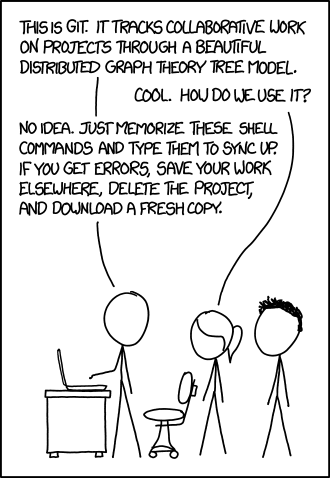

# Missing Semester 06 Version Control (Git)

### Git快速入门

[git快速入门 | 官方文档 (oscc.cc)](https://ysyx.oscc.cc/docs/ics-pa/git.html#%E6%B8%B8%E6%88%8F%E8%AE%BE%E7%BD%AE)

Git作为常用的版本管理软件，可以极大程度的改善用户开发体验。

例：在做智能车的时候，电磁导航部分和摄像头导航部分相对独立，可以分开开发。同时摄像头导航部分内又有多个版本（比如找中线，找中线+十字路口补线，找中线+十字路口补线+环岛等），一个trivial的想法就是每写完一次代码就复制一个文件夹，与他人协作的时候互传文件夹即可。但这样除了会造成电脑上多了几十个文件夹以外，还极易忘掉某个版本具体添加了什么代码。

Git的使用则可以大大优化这个流程，提升工作效率。

***Modern VCSs also let you easily (and often automatically) answer questions like:***

- ***Who wrote this module?***
- ***When was this particular line of this particular file edited? By whom? Why was it edited?***
- ***Over the last 1000 revisions, when/why did a particular unit test stop working?***

# 1. Git的数据模型

Git由于存在abstraction leakage的问题，自顶向下（类似从命令行/GUI开始一条条的看命令）的Git学习可能会带来很多困惑。因此先从Git的数据模型开始，了解git的工作方式，再进一步了解git命令。



## 1.1 ****Snapshots****

Git通过一系列Snapshots来进行版本管理（而不是其他Version Control System, VCS通过变化来管理）


Git 将顶级目录中的文件和文件夹作为集合，并通过一系列Snapshots来管理其历史记录。在Git的术语里，文件被称作Blob对象（数据对象），也就是一组数据。目录则被称之为Tree，它将名字与 Blob 对象或Tree对象进行映射（使得目录中可以包含其他目录）。Snapshots则是被追踪的最顶层的树。

```
<root> (tree)
|
+- foo (tree)
|  |
|  + bar.txt (blob, contents = "hello world")
|
+- baz.txt (blob, contents = "git is wonderful")
```

这个顶层的树包含了两个元素，一个名为 “foo” 的树（它本身包含了一个blob对象 “bar.txt” ），以及一个 blob 对象 “baz.txt” 。

关于****Snapshots：****

***Git thinks of its data more like a series of snapshots of a miniature filesystem. With Git, every time you commit, or save the state of your project, Git basically takes a picture of what all your files look like at that moment and stores a reference to that snapshot (ProGit, Page 15)***

***Git doesn’t store data as a series of changesets or differences, but instead as a series of snapshots. (ProGit, Page 63)***

## 1.2 Model of history: ****relating snapshots****

Git 中的历史记录是一个由快照组成的有向无环图(directed acyclic graph (DAG)) 。DAG代表 Git 中的每个快照都有一系列的“父辈（Parent）” ，也就是其之前的一系列snapshots。注意，snapshots可能具有多个“父辈”而非一个，因为某个snapshots可能由多个父辈而来。例如，经过合并（Merge）后的两条分支。

在 Git 中，这些snapshots被称为“提交（commit）” 。如下简图，一次o就可以看成是一次commit或者snapshot

```
o <-- o <-- o <-- o
            ^
             \
              --- o <-- o
```

箭头指向了当前提交的父辈（这是一种“在…之前”，而不是“在…之后”的关系）。在第三次提交之后，历史记录分岔成了两条独立的分支（Branch，这部分内容在ProGit中有详细论述）。这可能因为此时需要同时开发两个不同的特性，它们之间是相互独立的。

开发完成后，这些分支可能会被合并（Merge）并创建一个新的提交，这个新的提交会同时包含这些特性。新的提交会创建一个新的历史记录，看上去像这样（最新的合并提交用加粗标记）：

```
o <-- o <-- o <-- o <----**o**
            ^            /
             \          v
              --- o <-- o
```

***When you make a commit, Git stores a commit object that contains a pointer to the snapshot of the content you staged. This object also contains the author’s name and email address, the message that you typed, and pointers to the commit or commits that directly came before this commit (its parent or parents): zero parents for the initial commit, one parent for a normal commit, and multiple parents for a commit that results from a merge of two or more branches. (ProGit, Page 64)***


> 注意，实际上建立一个新的分支只是创建了一个新的可以指向不同版本的指针
> 
> 
> ***What happens when you create a new branch? Well, doing so creates a new pointer for you to move around. (ProGit, Page 65)***
> 
> 
> 

## 1.3 Git数据模型

用伪代码的方式来表达Git的数据模型

```
// 文件就是一组数据
type blob = array<byte>

// 一个包含文件和目录的目录
type tree = map<string, tree | blob>

// 每个提交都包含一个父辈，元数据和顶层树
type commit = struct {
    parent: array<commit>
    author: string
    message: string
    snapshot: tree
}
```

## 1.4 ****对象和内存寻址****

Git 中的对象可以是 blob、树或提交：

```
type object = blob | tree | commit
```

Git 在储存数据时，所有的对象都会基于它们的 [SHA-1 哈希](https://en.wikipedia.org/wiki/SHA-1) 进行寻址。

```
objects = map<string, object>

def store(object):
    id = sha1(object)
    objects[id] = object

def load(id):
    return objects[id]
```

Blobs、Tree和Commit都一样，它们都是对象。当它们引用其他对象时，它们并没有真正的在硬盘上保存这些对象，而是仅仅保存了它们的哈希值作为引用。

```
//这是最开始那个例子
<root> (tree)
|
+- foo (tree)
|  |
|  + bar.txt (blob, contents = "hello world")
|
+- baz.txt (blob, contents = "git is wonderful")
```

例如，上面例子中的树（可以通过 `git cat-file -p 698281bc680d1995c5f4caaf3359721a5a58d48d` 来进行可视化），看上去是这样的：

```
100644 blob 4448adbf7ecd394f42ae135bbeed9676e894af85    baz.txt
040000 tree c68d233a33c5c06e0340e4c224f0afca87c8ce87    foo
```

树本身会包含一些指向其他内容的指针，例如baz.txt (blob) 和 foo (Tree)。如果我们用 `git cat-file -p 4448adbf7ecd394f42ae135bbeed9676e894af85`，即通过哈希值查看 baz.txt 的内容，会得到以下信息：`git is wonderful`

## 1.5 ****引用****

现在，所有的Snapshots都可以通过它们的哈希值来标记了。但这也太不方便了，谁也记不住一串 40 位的十六进制字符。

针对这一问题，Git 的解决方法是给这些哈希值赋予人类可读的名字，也就是引用（references）。引用是指向提交的指针。与对象不同的是，它是可变的（引用可以被更新，指向新的提交）。例如，`master` 引用通常会指向主分支的最新一次提交。

```
references = map<string, string>

def update_reference(name, id):
    references[name] = id

def read_reference(name):
    return references[name]

def load_reference(name_or_id):
    if name_or_id in references:
        return load(references[name_or_id])
    else:
        return load(name_or_id)
```

这样，Git 就可以使用诸如 “master” 这样人类可读的名称来表示历史记录中某个特定的提交，而不需要在使用一长串十六进制字符了。

有一个细节需要我们注意， 通常情况下，我们会想要知道“我们当前所在位置”，并将其标记下来。这样当我们创建新的快照的时候，我们就可以知道它的相对位置（如何设置它的“父辈”）。在 Git 中，我们当前的位置有一个特殊的索引，它就是 “HEAD” 。

***How does Git know what branch you’re currently on? It keeps a special pointer called HEAD (ProGit, Page 66)***


## 1.6 **仓库**

最后，我们可以粗略地给出 Git 仓库的定义了：`对象` 和 `引用`。

在硬盘上，Git 仅存储对象和引用：因为其数据模型仅包含这些东西。所有的 `git` 命令都对应着对提交树的操作，例如增加对象，增加或删除引用。

# 2. Git常用命令

以下为讲义列出的常用Git命令：

## 2.1 **Basics**

- `git help <command>`: get help for a git command
- `git init`: creates a new git repo, with data stored in the `.git` directory
- `git status`: tells you what’s going on
- `git add <filename>`: adds files to staging area
- `git commit`: creates a new commit
    - Write [good commit messages](https://tbaggery.com/2008/04/19/a-note-about-git-commit-messages.html)!
    - Even more reasons to write [good commit messages](https://chris.beams.io/posts/git-commit/)!
- `git log`: shows a flattened log of history
- `git log --all --graph --decorate`: visualizes history as a DAG
- `git diff <filename>`: show changes you made relative to the staging area
- `git diff <revision> <filename>`: shows differences in a file between snapshots
- `git checkout <revision>`: updates HEAD and current branch

## 2.2 **Branching and merging**

- `git branch`: shows branches
- `git branch <name>`: creates a branch
- `git checkout -b <name>`: creates a branch and switches to it
    - same as `git branch <name>; git checkout <name>`
- `git merge <revision>`: merges into current branch
- `git mergetool`: use a fancy tool to help resolve merge conflicts
- `git rebase`: rebase set of patches onto a new base

## 2.3 **Remotes (eg Github)**

- `git remote`: list remotes
- `git remote add <name> <url>`: add a remote
- `git push <remote> <local branch>:<remote branch>`: send objects to remote, and update remote reference
- `git branch --set-upstream-to=<remote>/<remote branch>`: set up correspondence between local and remote branch
- `git fetch`: retrieve objects/references from a remote
- `git pull`: same as `git fetch; git merge`
- `git clone`: download repository from remote

## 2.4 **Undo**

- `git commit --amend`: edit a commit’s contents/message
- `git reset HEAD <file>`: unstage a file
- `git checkout -- <file>`: discard changes

## 2.5 **Advanced Git**

- `git config`: Git is [highly customizable](https://git-scm.com/docs/git-config)
- `git clone --depth=1`: shallow clone, without entire version history
- `git add -p`: interactive staging
- `git rebase -i`: interactive rebasing
- `git blame`: show who last edited which line
- `git stash`: temporarily remove modifications to working directory
- `git bisect`: binary search history (e.g. for regressions)
- `.gitignore`: [specify](https://git-scm.com/docs/gitignore) intentionally untracked files to ignore

---

# Exercise

1. If you don’t have any past experience with Git, either try reading the first couple chapters of [Pro Git](https://git-scm.com/book/en/v2) or go through a tutorial like [Learn Git Branching](https://learngitbranching.js.org/). As you’re working through it, relate Git commands to the data model.

看就好了，挺不错的一本小书

1. Clone the [repository for the class website](https://github.com/missing-semester/missing-semester).
    1. Explore the version history by visualizing it as a graph.
    2. Who was the last person to modify `README.md`? (Hint: use `git log` with an argument).
    3. What was the commit message associated with the last modification to the `collections:` line of `_config.yml`? (Hint: use `git blame` and `git show`).

首先创建alias缩写，之后使用缩写查看即可

```bash
❯ git config --global alias.graph 'log --all --graph --decorate --oneline'
❯ git graph
```

```bash
❯ git clone https://github.com/missing-semester/missing-semester.git
Cloning into 'missing-semester'...
remote: Enumerating objects: 2274, done.
remote: Counting objects: 100% (1417/1417), done.
remote: Compressing objects: 100% (494/494), done.
remote: Total 2274 (delta 943), reused 923 (delta 923), pack-reused 857
Receiving objects: 100% (2274/2274), 15.58 MiB | 6.66 MiB/s, done.
Resolving deltas: 100% (1355/1355), done.
```

```bash
* 4ffec43 Clarify that we don't want spam PRs
* 77bcf98 Add more informative 404 page
*   37b1718 Merge branch 'mattrighetti/master'
|\
| * f79848c Add link to Italian translation
|/
*   129c9ce Merge branch 'missing-semester-ar/master'
|\
| * 5ae4b0e Merge pull request #1 from missing-semester-ar/missing-semester-ar
|/|
| * 7ba1f85 Added link to Arabic language Translation
|/
* 0496624 Take note of some more URLs
*   dc609e6 Merge branch 'YesSeri/master'
|\
| * 6e7a157 Text inside pre is visible while printing as pdf.
|/
*   fffa09e Merge branch 'findyy99/master'
|\
| * 230b01c change `.zhistory` to `.zsh_history`
|/
* ac83824 Clean up title
* 1320c3c Switch to GA4
*   3cc8149 Merge branch 'TianyiFranklinWang/master'
|\
| * 823a800 Fix a wrong usage of ! within double quotation marks
|/
* d31a890 Switch to archived copy of image from deleted blog
* 0d12f56 Simplify build
```

使用git log <Filename>即可

```bash
commit 9ef9db72211fefc00caaa7133b35dda4a99acccf
Author: Anish Athalye <me@anishathalye.com>
Date:   Thu Oct 27 20:28:41 2022 -0400

    Add Docker setup for easier development

commit ad1ba94203e741723f8012467c2c861b34ad77c8
Author: Sebastian Kupek <sebastian.kupek@uibk.ac.at>
Date:   Wed Oct 26 18:15:19 2022 +0200

    FIX: Spelling mistakes,'content' should be plural and verb adjusted accordingly
```

使用git blame+grep搜索+git show即可

```bash
❯ git blame _config.yml | grep collection | awk {'print $1'} | xargs git show
commit a88b4eac326483e29bdac5ee0a39b180948ae7fc
Author: Anish Athalye <me@anishathalye.com>
Date:   Fri Jan 17 15:26:30 2020 -0500

    Redo lectures as a collection

diff --git a/2020/index.html b/2020/index.html
deleted file mode 100644
index 153ddc8..0000000
--- a/2020/index.html
+++ /dev/null
@@ -1,5 +0,0 @@
----
-layout: redirect
-redirect: /
-title: Missing Semester 2020
----
```

1. One common mistake when learning Git is to commit large files that should not be managed by Git or adding sensitive information. Try adding a file to a repository, making some commits and then deleting that file from history (you may want to look at [this](https://help.github.com/articles/removing-sensitive-data-from-a-repository/)).

[Removing sensitive data from a repository - GitHub Docs](https://docs.github.com/en/authentication/keeping-your-account-and-data-secure/removing-sensitive-data-from-a-repository#purging-a-file-from-your-repositorys-history)

```bash
echo "password1">my_password
git add .
git commit -m "add password1 to file"
git log HEAD

git filter-branch --force --index-filter 'git rm --cached --ignore-unmatch ./my_password' --prune-empty --tag-name-filter cat -- --all
```

1. Clone some repository from GitHub, and modify one of its existing files. What happens when you do `git stash`? What do you see when running `git log --all --oneline`? Run `git stash pop` to undo what you did with `git stash`. In what scenario might this be useful?

```bash
❯ git stash
Saved working directory and index state WIP on master: d966a21 Add link to Persian translation
❯ git stash pop
On branch master
Your branch is up to date with 'origin/master'.

Changes not staged for commit:
  (use "git add <file>..." to update what will be committed)
  (use "git restore <file>..." to discard changes in working directory)
        modified:   about.md

no changes added to commit (use "git add" and/or "git commit -a")
Dropped refs/stash@{0} (769bb5075f9807627f05e2135c5041cb614769ff)
❯ git log --all --oneline
d966a21 (HEAD -> master, origin/master, origin/HEAD) Add link to Persian translation
f06d145 Ignore hash for GitHub URLs
5eca88a Replace deleted Gist with Wayback Machine URL
```

1. Like many command line tools, Git provides a configuration file (or dotfile) called `~/.gitconfig`. Create an alias in `~/.gitconfig` so that when you run `git graph`, you get the output of `git log --all --graph --decorate --oneline`. Information about git aliases can be found [here](https://git-scm.com/docs/git-config#Documentation/git-config.txt-alias)

```bash
❯ git config --global alias.graph 'log --all --graph --decorate --oneline'
```

1. You can define global ignore patterns in `~/.gitignore_global` after running `git config --global core.excludesfile ~/.gitignore_global`. Do this, and set up your global gitignore file to ignore OS-specific or editor-specific temporary files, like `.DS_Store`.

```bash
git config --global core.excludesfile ~/.gitignore .DS_Store
```